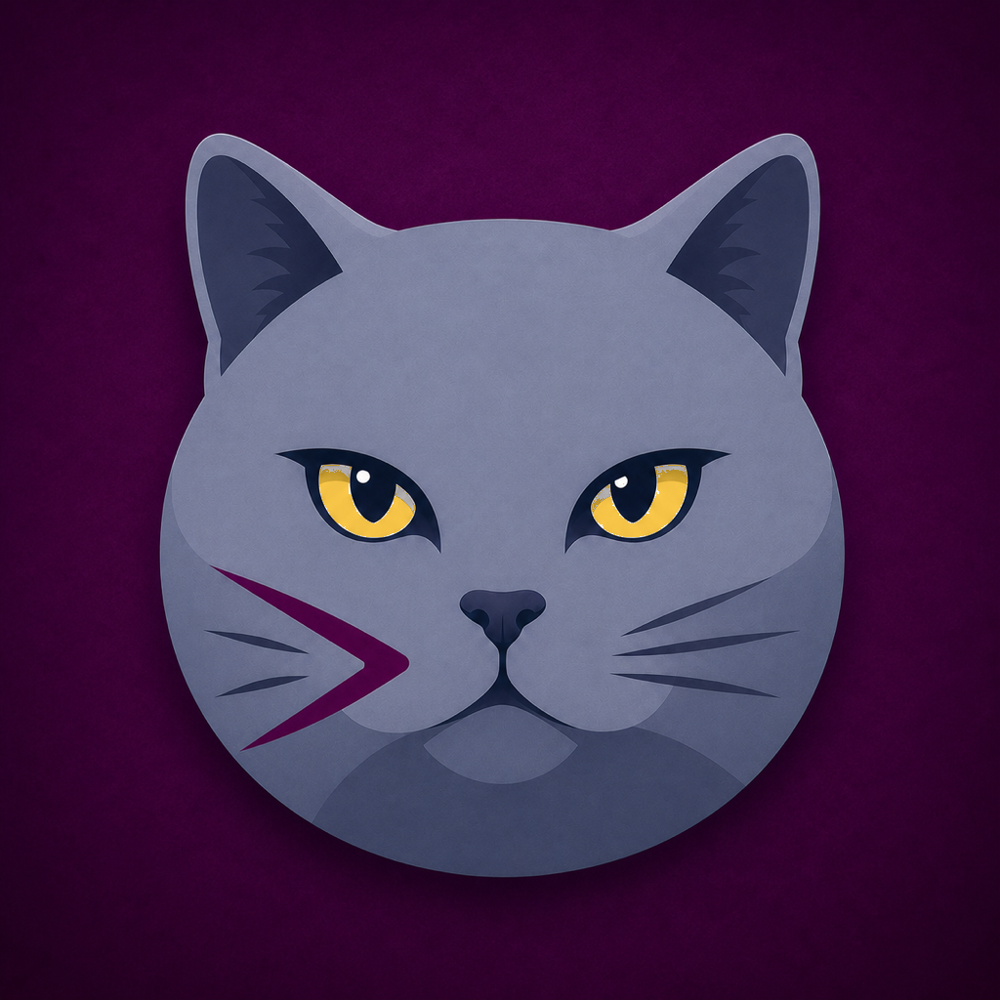
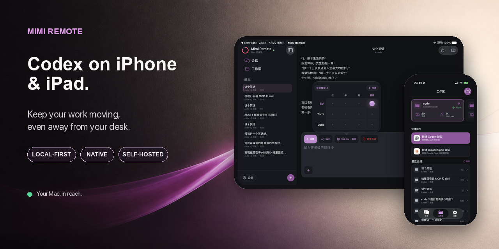
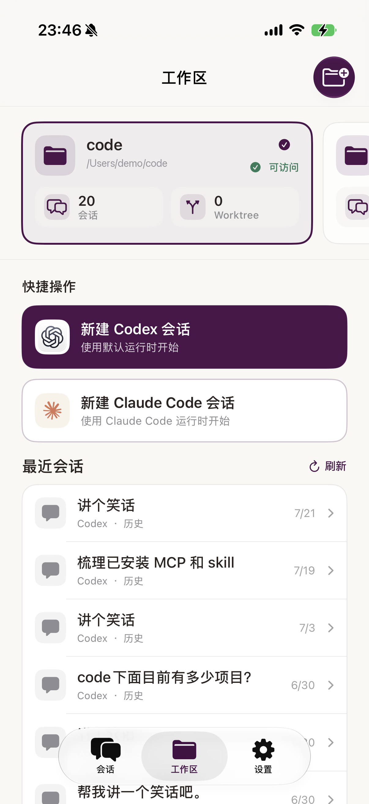
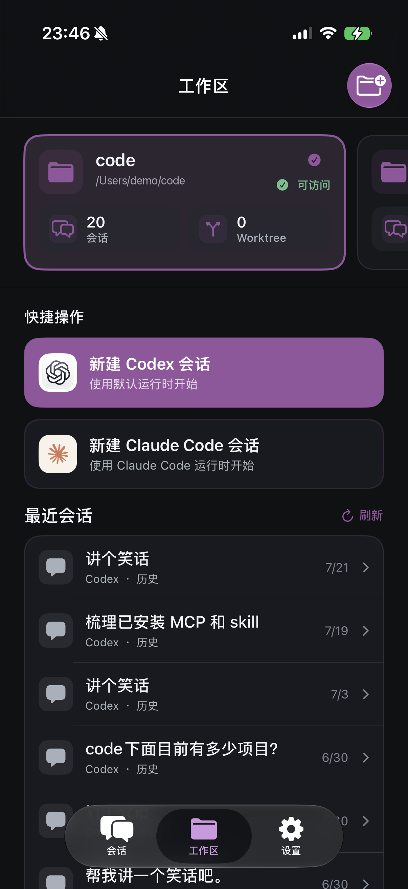
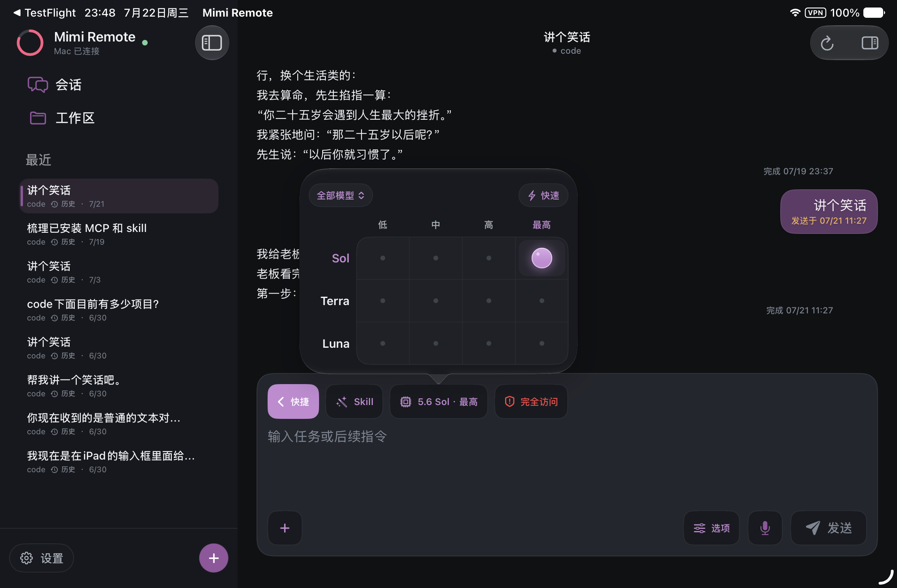
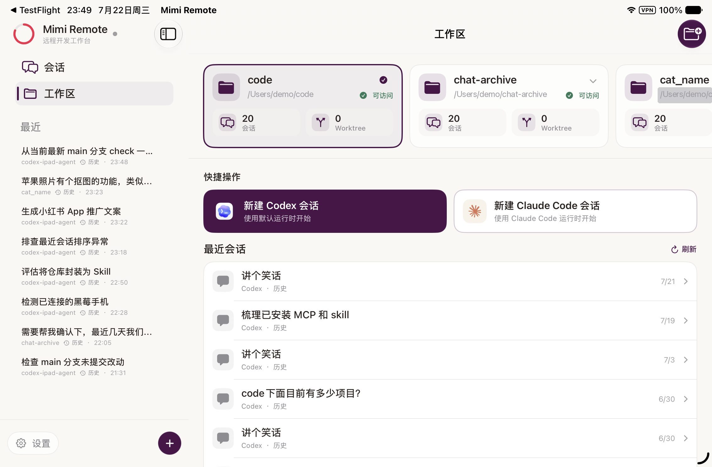
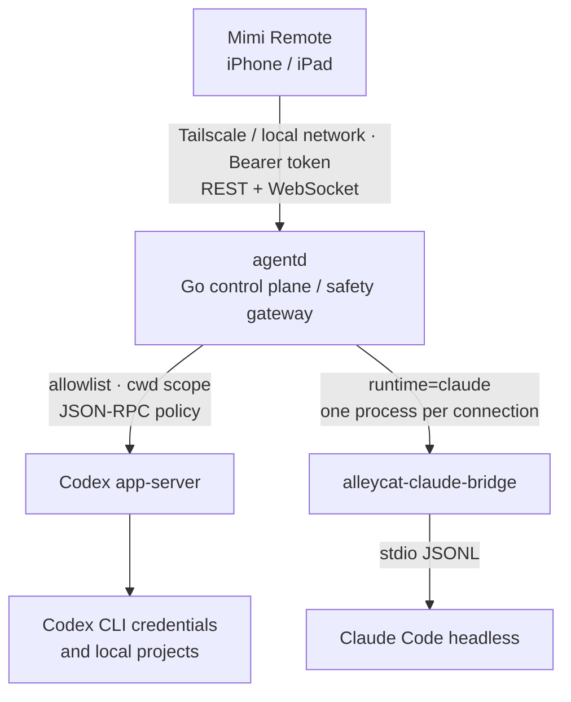

<p align="center">
  
</p>

<h1 align="center">Mimi Remote</h1>

<p align="center">
  <strong>Codex on iPhone and iPad. Away from your desk.</strong>
</p>

<p align="center">
  A native, local-first mobile workbench for coding agents running on your own Mac.<br />
  Review results, steer sessions, approve actions, manage Worktrees, and finish Git workflows from iPhone or iPad.
</p>

<p align="center">
  <a href="README.zh-CN.md">中文文档</a>
  &nbsp;·&nbsp;
  <a href="ios/MimiRemote/README.md">iOS build guide</a>
  &nbsp;·&nbsp;
  <a href="docs/project-status.md">Project status (Chinese)</a>
</p>

<p align="center">
  <a href="ios/MimiRemote/README.md"></a>
  <a href="ios/MimiRemote"></a>
  <a href="https://github.com/gaixianggeng/codex-ipad-agent/actions/workflows/go-ci.yml"></a>
  <a href="LICENSE"></a>
</p>

<p align="center">
  
</p>

Mimi Remote connects to your Mac through Tailscale or the same local network and keeps source code, agent credentials, and full sessions on your own devices. Codex is the primary supported runtime; an optional Claude Code bridge is available as an experimental channel.

Mimi Remote is an independent third-party project. It is not affiliated with, endorsed by, or a product of OpenAI, Anthropic, or Tailscale.

> There is no public App Store release at this time. Build the iOS app from source; any internal TestFlight distribution is not a public download channel.

## One workbench, every screen.

<table>
  <tr>
    <td width="50%" align="center">
      <strong>Light when you want clarity.</strong><br />
      <sub>Jump into a project, start a Codex or Claude Code session, and return to recent work.</sub>
    </td>
    <td width="50%" align="center">
      <strong>Dark when you want focus.</strong><br />
      <sub>The same native hierarchy adapts to the system appearance without changing your workflow.</sub>
    </td>
  </tr>
  <tr>
    <td width="50%" valign="top" align="center">
      
    </td>
    <td width="50%" valign="top" align="center">
      
    </td>
  </tr>
  <tr>
    <td width="50%" align="center">
      <strong>Keep controls in context.</strong><br />
      <sub>Choose the model, reasoning level, skill, speed, and permission mode without leaving the conversation.</sub>
    </td>
    <td width="50%" align="center">
      <strong>Use the full iPad canvas.</strong><br />
      <sub>Keep projects, recent sessions, and quick actions visible in one spacious native workspace.</sub>
    </td>
  </tr>
  <tr>
    <td width="50%" valign="top">
      
    </td>
    <td width="50%" valign="top">
      
    </td>
  </tr>
</table>

These screenshots were provided by the maintainer from an actual TestFlight build in daily use; the interface language follows the capture device. Personal filesystem paths were replaced with `/Users/demo/...` before publication. No access tokens or Tailnet addresses are shown. See the [screenshot manifest](artifacts/app-screenshots/manifest.md) for details.

## What it does

- Native SwiftUI workbench for iPhone and iPad, including themes, Dynamic Type-friendly sizing, and compact/three-column layouts.
- Codex session browsing, search, create/resume, structured streaming output, steer, interrupt, approvals, goals, review, fork, archive, and local pinning.
- Managed Git Worktrees: create, inspect, switch branches, preview protected cleanup, and confirm deletions.
- Git status and diffs; file/hunk stage, unstage, revert, commit, push, and draft pull-request workflows.
- Markdown, image and file references, voice transcription, Quick Look-safe file reads, and bounded log export.
- Multiple Mac profiles with separate Keychain tokens; only one active Mac connection at a time.
- Diagnostics, readiness checks, offline recovery, protocol-drift checks, and source-build tooling.

Codex is the primary supported runtime. Claude Code is available only through the optional bridge described below.

## Architecture



The iOS app stores only the outer `agentd` token in Keychain. The loopback app-server capability token stays on the Mac. `agentd` limits access to configured projects, `browse_roots`, and managed Worktrees; remote commands are limited to configured actions with confirmation, timeout, and output limits.

## Install and run

### 1. Prepare your Mac

Requirements:

- A Mac with Codex CLI installed and signed in.
- The Mac and iPhone/iPad connected to the same private network. Tailscale is recommended for access across different networks but is optional for same-LAN use.
- Homebrew on macOS.
- Xcode 26 or later, including an iOS 26 SDK.

```bash
brew update
brew install gaixianggeng/tap/mimi-remote

codex --version
codex app-server --help
agentd up
```

`agentd up` creates private local configuration and separate tokens, starts the service, waits for the app-server WebSocket, and prints a short-lived pairing QR code. It prefers Tailscale when available; otherwise it enables same-LAN access and publishes the current private LAN address.

Useful commands:

```bash
agentd status
agentd pair
agentd doctor --fix
agentd logs -n 200
agentd up --no-pair
agentd restart
agentd restart --no-pair
agentd stop
```

On macOS, `agentd restart` uses one atomic launchd kickstart, so it is safe to trigger from a remote task hosted by the current service. Do not run `brew services restart mimi-remote` directly from such a task.
From an agent, automation, or retained remote log, use `agentd up --no-pair` / `agentd restart --no-pair` so the output contains no pairing QR code, endpoint, or long-lived access token. `agentd up --no-pair --json` returns only the version, readiness state, and safe warnings rather than the complete setup result. When pairing is needed, have the user run `agentd pair --qr-only` in a local terminal.

For Linux installation and recovery steps, see [Install, upgrade, and rollback (Chinese)](docs/install-upgrade-rollback.md).

To let Codex perform the same install, upgrade, diagnosis, and rollback workflow with the repository's safety constraints, install the standalone Skill from:

```text
https://github.com/gaixianggeng/mimi-remote/tree/main/packaging/skill/install-mimi-remote
```

Ask `$skill-installer` to install that GitHub path. Each GitHub Release also includes `install-mimi-remote.zip` and its SHA-256 file for an auditable, versioned copy.

### 2. Build the iOS app from source

Mimi Remote requires iOS/iPadOS 26 or later. Install XcodeGen before generating the Xcode project:

```bash
brew install xcodegen

xcodegen generate \
  --spec ios/MimiRemote/project.yml \
  --project ios/MimiRemote

open ios/MimiRemote/MimiRemote.xcodeproj
```

In Xcode, select the `MimiRemote` scheme, your development team, and an iPhone or iPad target, then Run. On first launch, scan the QR code printed by `agentd up` or `agentd pair`. The QR code is a short-lived, single-use pairing ticket, not a long-lived token. Manual connection is available as a fallback.

Command-line build verification:

```bash
xcodebuild \
  -project ios/MimiRemote/MimiRemote.xcodeproj \
  -scheme MimiRemote \
  -configuration Debug \
  -sdk iphoneos \
  CODE_SIGNING_ALLOWED=NO \
  build-for-testing
```

### 3. Build the backend from source (optional)

```bash
go test ./...
go vet ./...

# Foreground development; does not replace the Homebrew service.
go build -trimpath -o bin/agentd ./cmd/agentd
./bin/agentd setup --scan-root "$HOME/code" --browse-root "$HOME"
./bin/agentd serve
```

For repeated macOS testing against the installed Homebrew service, use the signed handoff pipeline instead of copying an ad-hoc Go binary into the Cellar:

```bash
bash ./scripts/restart-agentd-dev-macos.sh

# When triggered from a remote Mimi task:
bash ./scripts/restart-agentd-dev-macos.sh --no-wait
bash ./scripts/restart-agentd-dev-macos.sh --status
```

It signs each development build with a stable Apple Development identity, hands the replacement to an independent launchd job, verifies readiness, and rolls back automatically. At the beginning of every service start, agentd asynchronously probes configured project, scan, and browse roots; a browse root covering the current Home also probes Desktop, Documents, and Downloads so macOS Files & Folders prompts appear before the first real task. The probe never recursively reads files and never blocks the remote control plane while waiting for a click.

macOS does not provide one background-requestable permission for the entire user Home: Desktop, Documents, and Downloads are separate protected locations, while unattended access to other apps' data requires Full Disk Access. For that use case, add `/opt/homebrew/opt/mimi-remote/bin/agentd` once under System Settings → Privacy & Security → Full Disk Access. The first migration from an old ad-hoc build can still require one final approval.

## Claude Code bridge (experimental)

The Claude bridge is disabled by default. It runs one `alleycat-claude-bridge` child process for each Claude WebSocket connection and translates the iOS app-server JSON-RPC surface to Claude Code headless JSONL.

Install the bridge from this repository:

```bash
cargo install --git https://github.com/gaixianggeng/codex-ipad-agent.git \
  --locked --force --bin alleycat-claude-bridge alleycat-claude-bridge

command -v alleycat-claude-bridge
```

Enable it explicitly in the user configuration:

```json
{
  "claude": {
    "enabled": true,
    "bridge_bin": "/opt/homebrew/bin/alleycat-claude-bridge",
    "args": [],
    "max_concurrent_bridges": 3,
    "env": { "TERM": "xterm-256color" }
  }
}
```

This is an experimental channel: a network interruption, device lock, or WebSocket close terminates the bridge and can interrupt the current turn. Goal, archive, and fork are not available for Claude sessions. Read the [Claude bridge architecture (Chinese)](docs/claude-bridge-architecture.md) before enabling it.

## Current limitations

- Mimi Remote is not a general-purpose SSH terminal and does not run Codex inside the iOS sandbox.
- It has no cloud account, code-hosting proxy, public relay, arbitrary remote shell, unattended deletion, or multi-user sharing.
- One iOS WebSocket can attach to a session at a time. Cloud/projectless threads, background push, offline remote notifications, profile sync, and IDE sync are not implemented.
- A private Tailscale address is recommended across networks. Without Tailscale, Mimi Remote can use a private LAN address only while both devices are on the same local network. Do not expose `agentd` directly to the public Internet.
- Claude Code support depends on external CLI and bridge behavior, has a smaller feature surface, and must not be treated as the default runtime.

For the complete, code-oriented capability matrix and risk list, see [project status (Chinese)](docs/project-status.md).

## Privacy and security

Mimi Remote has no ads, analytics SDK, or maintainer-operated telemetry service. Project content, conversations, logs, code, and Codex/Claude credentials remain on your devices unless you explicitly use a third-party service such as Codex, Claude Code, GitHub, Codex voice transcription, or MCP. Apple voice input uses on-device SpeechAnalyzer processing.

The app rejects public HTTP endpoints at the application layer and is designed for Tailscale or same-LAN private-network use. Do not put real tokens, Tailnet IPs, private paths, logs, or project content in public issues, pull requests, or screenshots. Report vulnerabilities privately using [SECURITY.md](SECURITY.md). See the bilingual [privacy policy](docs/privacy-policy.md), [terms of use](docs/terms-of-use.md), and [support page](docs/support.md).

## Development checks

Run the checks appropriate to the area you changed:

```bash
go test ./... -count=1
go vet ./...
bash ./scripts/check-codex-protocol.sh
bash ./scripts/check-ios-localization.sh
bash ./scripts/check-public-repo-safety.sh
bash ./scripts/check-third-party-notices.sh
bash ./scripts/check-ios-privacy-manifest.sh
bash ./scripts/restart-agentd-dev-macos.sh --self-test
bash ./scripts/verify-release.sh
```

For bridge work:

```bash
cargo test --locked \
  -p alleycat-codex-proto \
  -p alleycat-bridge-core \
  -p alleycat-claude-bridge
```

## Repository layout

```text
ios/MimiRemote/          SwiftUI iPhone / iPad app
cmd/agentd/ + internal/  Go safety gateway and Codex / Claude control plane
bridges/claude/          Rust Claude Code protocol bridge
```

This repository is the complete source repository. [`gaixianggeng/mimi-remote`](https://github.com/gaixianggeng/mimi-remote) remains a public backend-release mirror to preserve existing Go release and Homebrew download URLs.

## Contributing

Open a [GitHub issue](https://github.com/gaixianggeng/codex-ipad-agent/issues/new) with a reproducible problem or proposal. Read [CONTRIBUTING.md](CONTRIBUTING.md) before submitting code. Links to Chinese technical docs above are labeled explicitly; English contributions are welcome.

## License

Mimi Remote's iOS app, Go backend, and documentation are licensed under [GNU GPLv3](LICENSE) with an additional App Store / Google Play distribution permission under GPLv3 section 7. Commercial use is not prohibited, but distribution of modified versions or binaries must meet GPLv3 obligations, including corresponding source and the same license.

[`bridges/claude`](bridges/claude) is derived from Alleycat contributors and remains [GPLv3-only](bridges/claude/LICENSE); the root store-distribution exception does not apply to that upstream code. Third-party notices are in [NOTICE.md](NOTICE.md) and [THIRD_PARTY_NOTICES.md](THIRD_PARTY_NOTICES.md).
