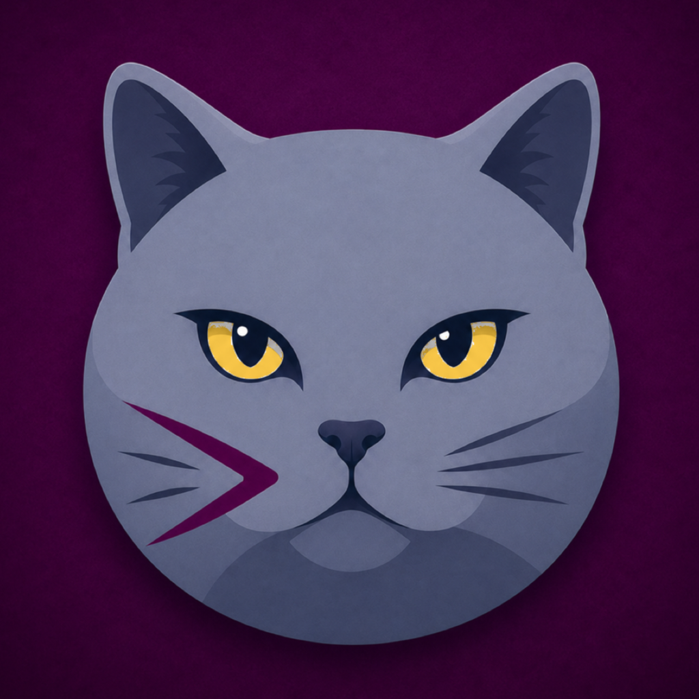
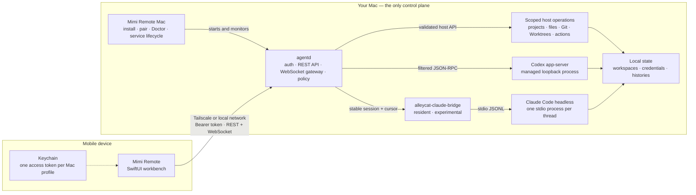

<p align="center">
  
</p>

<h1 align="center">Mimi Remote</h1>

<p align="center">
  <strong>Let your Mac keep working. You do not have to stay at it.</strong>
</p>

<p align="center">
  A native, local-first mobile workbench for Codex sessions running on your own Mac.<br />
  Check in from iPhone, steer from iPad, and finish review or Git work on iPad Pro.
</p>

<p align="center">
  <a href="README.zh-CN.md">中文文档</a>
  &nbsp;·&nbsp;
  <a href="ios/MimiRemote/README.md">iOS build guide</a>
  &nbsp;·&nbsp;
  <a href="docs/project-status.md">Project status (Chinese)</a>
</p>

<p align="center">
  <a href="ios/MimiRemote/README.md"></a>
  <a href="ios/MimiRemote"></a>
  <a href="https://github.com/gaixianggeng/codex-ipad-agent/actions/workflows/go-ci.yml"></a>
  <a href="LICENSE"></a>
</p>

<p align="center">
  
</p>

<p align="center">
  <sub>A real iPad Pro, a real Debug build, and public demo data — no mockup UI.</sub>
</p>

Mimi Remote connects directly to your Mac through Tailscale or the same local network. The project does not operate a relay, account system, or hosted session service. Your Mac remains the control plane; data you intentionally send to Codex, Claude Code, GitHub, voice transcription, or MCP is still handled by those services under their own terms.

Mimi Remote is an independent third-party project. It is not affiliated with, endorsed by, or a product of OpenAI, Anthropic, or Tailscale. Codex is the primary supported runtime; the optional Claude Code bridge is experimental.

> There is no public App Store release yet. Build the iOS app from source; internal TestFlight builds are not a public download channel.

<table>
  <tr>
    <td width="50%" align="center">
      <strong>iPhone · glance and steer</strong><br />
      <sub>Catch up on the result, add context, approve the next step, or stop a turn.</sub>
    </td>
    <td width="50%" align="center">
      <strong>iPad · stay in context</strong><br />
      <sub>Keep the conversation, queued follow-ups, model, permissions, and controls together.</sub>
    </td>
  </tr>
  <tr>
    <td width="50%" valign="top" align="center">
      
    </td>
    <td width="50%" valign="top" align="center">
      
    </td>
  </tr>
</table>

All three images were captured from the same source tree on physical devices through Xcode Device Hub. The Debug-only seed uses `/Users/demo`, placeholder credentials, and public demo copy; no personal repository, access token, endpoint, or Tailnet address is shown. See the [screenshot manifest](artifacts/app-screenshots/manifest.md).

## Leave the desk, not the flow

The useful moment is rarely “open a terminal on a phone.” It is “the agent finished while I was away — let me understand what changed and decide what happens next.”

- **Glance:** see whether a task is thinking, waiting, failed, or complete without reopening the Mac.
- **Steer:** add context, queue the next instruction, change model or reasoning, answer a prompt, approve an action, or interrupt the turn.
- **Finish:** inspect status and diffs, manage Worktrees, stage a file or hunk, commit, push, and open a draft pull request.

On iPhone, the hierarchy stays compact and touch-first. On iPad, the same native SwiftUI app expands into a workbench with projects, sessions, conversation, and inspector space instead of stretching a phone layout.

## More than a pocket terminal

- Structured Codex output groups messages, reasoning, commands, tool calls, approvals, and work into a readable timeline.
- New Codex sessions receive a concise model-generated title from the Mac host; title generation is asynchronous and never blocks the conversation.
- Model, reasoning level, Skill, speed, permission mode, and queued turns stay next to the composer.
- Markdown, images, file references, voice input, and safe Quick Look reads work as mobile-native content.
- Worktree and Git actions expose previews, confirmations, timeouts, and bounded output instead of an unrestricted remote shell.
- Multiple Mac profiles keep separate tokens in Keychain; one active connection keeps the mental model simple.
- Readiness checks, reconnection, diagnostics, and bounded log export help recover without returning to the desk.

## Designed around context, not screen size

Mimi Remote keeps the same project and session model across devices, but each surface follows the way that device is actually used. The iPad becomes a context-preserving workbench; the Mac stays a compact operational control surface instead of duplicating the mobile app.

<table>
  <tr>
    <td width="50%" align="center">
      <strong>Projects are first-class</strong><br />
      <sub>Project state, quick starts, and recent conversations share one continuous workspace.</sub>
    </td>
    <td width="50%" align="center">
      <strong>Settings keep your place</strong><br />
      <sub>Quota, connectivity, language, appearance, and permissions open over the current context.</sub>
    </td>
  </tr>
  <tr>
    <td width="50%" valign="top" align="center">
      
    </td>
    <td width="50%" valign="top" align="center">
      
    </td>
  </tr>
</table>

<p align="center">
  
</p>

<p align="center">
  <sub>The 340-point Mac menu keeps host health, Codex and Claude runtime state, quota rings, pairing, diagnostics, and recovery actions one click away.</sub>
</p>

The hierarchy is intentional:

- **Preserve context:** the iPad sidebar keeps projects and sessions visible while the detail area changes; settings use a sheet so the workbench does not disappear.
- **Disclose complexity progressively:** common status and actions stay close to the task, while setup, pairing, diagnostics, and deeper preferences move into focused surfaces.
- **Show state before action:** connection health, runtime readiness, remaining quota, and permission mode are visible before controls that can change or interrupt work.
- **Use each platform natively:** compact touch hierarchy on iPhone, multi-column workbench on iPad, and a dense menu bar utility on Mac — not one layout stretched across three screens.

The two iPad detail images were captured from the current Debug build on a reused iPad Pro simulator. The Mac image uses the same source tree with Debug-only seeded UI and the public `mimi-demo.local` hostname. The installed Mac service was not restarted or replaced. See the [screenshot manifest](artifacts/app-screenshots/manifest.md).

## Architecture


```mermaid
flowchart LR
    subgraph Mobile["Mobile device"]
        App["Mimi Remote<br/>SwiftUI workbench"]
        Keychain["Keychain<br/>one access token per Mac profile"]
        Keychain -.-> App
    end

    subgraph Mac["Your Mac — the only control plane"]
        Host["Mimi Remote Mac<br/>install · pair · Doctor · service lifecycle"]
        Agent["agentd<br/>auth · REST API · WebSocket gateway · policy"]
        Local["Scoped host operations<br/>projects · files · Git · Worktrees · actions"]
        Codex["Codex app-server<br/>managed loopback process"]
        Bridge["alleycat-claude-bridge<br/>resident · experimental"]
        Claude["Claude Code headless<br/>one stdio process per thread"]
        State["Local state<br/>workspaces · credentials · histories"]

        Host -->|"starts and monitors"| Agent
        Agent -->|"validated host API"| Local
        Agent -->|"filtered JSON-RPC"| Codex
        Agent -->|"stable session + cursor"| Bridge
        Bridge -->|"stdio JSONL"| Claude
        Local --> State
        Codex --> State
        Claude --> State
    end

    App -->|"Tailscale or local network<br/>Bearer token · REST + WebSocket"| Agent
```

Mimi Remote is a native client, not a second place where the agent runs. Every remote request terminates at `agentd` on your Mac; the iOS app never connects directly to Codex app-server, Claude Code, the local filesystem, or a hosted Mimi service.

There are three paths through the system:

1. **Host lifecycle:** Mimi Remote Mac installs, pairs, diagnoses, starts, and monitors `agentd`. It is not in the per-request data path. Homebrew or user-systemd can run the same Go service for command-line and Linux setups.
2. **Bounded host capabilities:** project discovery, safe file reads, Git, managed Worktrees, diagnostics, voice proxying, and configured actions use authenticated REST endpoints implemented by `agentd`. They do not pass through Codex.
3. **Agent sessions:** the mobile app uses one external Codex-compatible JSON-RPC/WebSocket gateway. `agentd` validates the runtime, method, project-derived working directory, payload size, and connection budget before routing the request to the primary Codex app-server or the experimental Claude bridge.

Codex app-server is a managed loopback process and remains the primary runtime. The optional resident Claude bridge keeps a stable session key and replay cursor across mobile reconnects, then owns one headless Claude Code stdio process per active thread. Provider-specific differences stay behind this adapter boundary; the shared mobile UI does not imply feature parity.

The security boundary is deliberately concentrated on the Mac:

- A QR code carries a short-lived, single-use pairing ticket. The resulting long-lived `agentd` token is stored in Keychain per Mac profile.
- The app-server capability token and provider credentials never leave the Mac. The managed app-server endpoint listens on loopback.
- Client-supplied project IDs are resolved through the configured project allowlist. File access is limited to project roots, `browse_roots`, and managed Worktrees.
- Git and Worktree APIs expose fixed, validated operations. General commands must be configured as actions and use confirmation, timeouts, request limits, and bounded output.
- Live events use sequence/cursor replay after normal reconnects; when a replay window is insufficient, the client reloads authoritative local history instead of resubmitting the turn.

This shape keeps deployment small and auditable, but the tradeoff is explicit: the Mac must be awake and privately reachable, and `agentd` plus the selected runtime must be healthy. There is no maintainer-operated relay, cloud state sync, or APNs background execution path.

## Install and run

### 1. Prepare your Mac

Requirements:

- A Mac running macOS 26 or later, with Codex CLI installed and signed in.
- The Mac and iPhone/iPad connected to the same private network. Tailscale is recommended for access across different networks but is optional for same-LAN use.

For the normal setup path, download [`Mimi-Remote-Mac.dmg`](https://github.com/gaixianggeng/codex-ipad-agent/releases/latest/download/Mimi-Remote-Mac.dmg) and its SHA-256 file, verify the checksum, open the DMG, drag **Mimi Remote Mac** to Applications, then finish first-run setup from the menu bar. The app includes `agentd` and the compatible Claude bridge; Homebrew, Go, Rust, and Xcode are not required for the Mac host.

For command-line installation, server use, or recovery:

```bash
brew update
brew install gaixianggeng/tap/mimi-remote

codex --version
codex app-server --help
agentd up
```

`agentd up` creates private local configuration and separate tokens, starts the service, waits for the app-server WebSocket, and prints a short-lived pairing QR code. It prefers Tailscale when available; otherwise it enables same-LAN access and publishes the current private LAN address.

Useful commands:

```bash
agentd status
agentd pair
agentd doctor --fix
agentd logs -n 200
agentd up --no-pair
agentd restart
agentd restart --no-pair
agentd stop
```

On macOS, `agentd restart` uses one atomic launchd kickstart, so it is safe to trigger from a remote task hosted by the current service. Do not run `brew services restart mimi-remote` directly from such a task.
From an agent, automation, or retained remote log, use `agentd up --no-pair` / `agentd restart --no-pair` so the output contains no pairing QR code, endpoint, or long-lived access token. `agentd up --no-pair --json` returns only the version, readiness state, and safe warnings rather than the complete setup result. When pairing is needed, have the user run `agentd pair --qr-only` in a local terminal.

For Linux installation and recovery steps, see [Install, upgrade, and rollback (Chinese)](docs/install-upgrade-rollback.md).

To let Codex perform the same install, upgrade, diagnosis, and rollback workflow with the repository's safety constraints, install the standalone Skill from:

```text
https://github.com/gaixianggeng/codex-ipad-agent/tree/main/packaging/skill/install-mimi-remote
```

Ask `$skill-installer` to install that GitHub path. Each GitHub Release also includes `install-mimi-remote.zip` and its SHA-256 file for an auditable, versioned copy.

### 2. Build the iOS app from source

Mimi Remote requires iOS/iPadOS 26 or later. Install XcodeGen before generating the Xcode project:

```bash
brew install xcodegen

xcodegen generate \
  --spec ios/MimiRemote/project.yml \
  --project ios/MimiRemote

open ios/MimiRemote/MimiRemote.xcodeproj
```

In Xcode, select the `MimiRemote` scheme, your development team, and an iPhone or iPad target, then Run. On first launch, scan the QR code printed by `agentd up` or `agentd pair`. The QR code is a short-lived, single-use pairing ticket, not a long-lived token. Manual connection is available as a fallback.

Command-line build verification:

```bash
xcodebuild \
  -project ios/MimiRemote/MimiRemote.xcodeproj \
  -scheme MimiRemote \
  -configuration Debug \
  -sdk iphoneos \
  CODE_SIGNING_ALLOWED=NO \
  build-for-testing
```

### 3. Build the backend from source (optional)

```bash
go test ./...
go vet ./...

# Foreground development; does not replace the Homebrew service.
go build -trimpath -o bin/agentd ./cmd/agentd
./bin/agentd setup --scan-root "$HOME/code" --browse-root "$HOME"
./bin/agentd serve
```

For repeated macOS testing against the installed Homebrew service, use the signed handoff pipeline instead of copying an ad-hoc Go binary into the Cellar:

```bash
bash ./scripts/restart-agentd-dev-macos.sh

# When triggered from a remote Mimi task:
bash ./scripts/restart-agentd-dev-macos.sh --no-wait
bash ./scripts/restart-agentd-dev-macos.sh --status
```

It signs each development build with a stable Apple Development identity, hands the replacement to an independent launchd job, verifies readiness, and rolls back automatically. At the beginning of every service start, agentd asynchronously probes configured project, scan, and browse roots; a browse root covering the current Home also probes Desktop, Documents, and Downloads so macOS Files & Folders prompts appear before the first real task. The probe never recursively reads files and never blocks the remote control plane while waiting for a click.

macOS does not provide one background-requestable permission for the entire user Home: Desktop, Documents, and Downloads are separate protected locations, while unattended access to other apps' data requires Full Disk Access. For that use case, add `/opt/homebrew/opt/mimi-remote/bin/agentd` once under System Settings → Privacy & Security → Full Disk Access. The first migration from an old ad-hoc build can still require one final approval.

## Claude Code bridge (experimental)

The Claude runtime is disabled by default. When enabled, `agentd` supervises one resident `alleycat-claude-bridge` and attaches mobile WebSocket sessions to it by a stable session key. Each Claude thread owns a headless stdio JSONL process; reconnects replay missed events or reload authoritative history instead of resubmitting `turn/start`.

The Mac DMG already includes a signed, compatible bridge next to `agentd`; do not install a second copy with Cargo for that setup. Install the bridge from source only for Homebrew, Linux, or standalone development:

```bash
cargo install --git https://github.com/gaixianggeng/codex-ipad-agent.git \
  --locked --force --bin alleycat-claude-bridge alleycat-claude-bridge

command -v alleycat-claude-bridge
```

Enable it explicitly in the user configuration:

```json
{
  "claude": {
    "enabled": true,
    "bridge_bin": "",
    "args": [],
    "max_concurrent_bridges": 3,
    "env": { "TERM": "xterm-256color" }
  }
}
```

An empty `bridge_bin` selects the bridge bundled with Mimi Remote Mac. Homebrew and Linux installations must instead set the absolute path returned by `command -v alleycat-claude-bridge`. The configuration file contains long-lived credentials: back it up privately, update only the `claude` fields with a JSON-aware tool, preserve mode `0600`, and never print the complete file into logs or chats.

After changing the configuration, restart from the current service owner: use **Restart Service** in the Mimi Remote Mac menu, `agentd restart --no-pair` for Homebrew, or the user-systemd service on Linux. Run Doctor and confirm that the mobile runtime picker exposes Claude without disrupting Codex.

This remains an experimental channel. Goal, archive, and fork are not available for Claude sessions; there is no APNs background push or cloud synchronization. A bounded replay ring covers normal disconnects, while bridge/Mac restarts fall back to local Claude history and can still lose a very small unflushed window. Read the [Claude bridge architecture (Chinese)](docs/claude-bridge-architecture.md) before enabling it.

## Current limitations

- Mimi Remote is not a general-purpose SSH terminal and does not run Codex inside the iOS sandbox.
- It has no cloud account, code-hosting proxy, public relay, arbitrary remote shell, unattended deletion, or multi-user sharing.
- One iOS WebSocket can attach to a session at a time. Cloud/projectless threads, background push, offline remote notifications, profile sync, and IDE sync are not implemented.
- A private Tailscale address is recommended across networks. Without Tailscale, Mimi Remote can use a private LAN address only while both devices are on the same local network. Do not expose `agentd` directly to the public Internet.
- Claude Code support depends on external CLI and bridge behavior, has a smaller feature surface, and must not be treated as the default runtime.

For the complete, code-oriented capability matrix and risk list, see [project status (Chinese)](docs/project-status.md).

## Privacy and security

Mimi Remote has no ads, analytics SDK, or maintainer-operated telemetry service. Project content, conversations, logs, code, and Codex/Claude credentials remain on your devices unless you explicitly use a third-party service such as Codex, Claude Code, GitHub, Codex voice transcription, or MCP. Apple voice input uses on-device SpeechAnalyzer processing.

The app rejects public HTTP endpoints at the application layer and is designed for Tailscale or same-LAN private-network use. Do not put real tokens, Tailnet IPs, private paths, logs, or project content in public issues, pull requests, or screenshots. Report vulnerabilities privately using [SECURITY.md](SECURITY.md). See the bilingual [privacy policy](docs/privacy-policy.md), [terms of use](docs/terms-of-use.md), and [support page](docs/support.md).

## Development checks

Run the checks appropriate to the area you changed:

```bash
go test ./... -count=1
go vet ./...
bash ./scripts/check-codex-protocol.sh
bash ./scripts/check-ios-localization.sh
bash ./scripts/check-public-repo-safety.sh
bash ./scripts/check-third-party-notices.sh
bash ./scripts/check-ios-privacy-manifest.sh
bash ./scripts/restart-agentd-dev-macos.sh --self-test
bash ./scripts/verify-release.sh
```

For bridge work:

```bash
cargo test --locked \
  -p alleycat-codex-proto \
  -p alleycat-bridge-core \
  -p alleycat-claude-bridge
```

## Repository layout

```text
ios/MimiRemote/          SwiftUI iPhone / iPad app
cmd/agentd/ + internal/  Go safety gateway and Codex / Claude control plane
bridges/claude/          Rust Claude Code protocol bridge
```

This repository is the complete source and release repository. New Mac, Go, Linux, Homebrew, and Skill artifacts are published here. [`gaixianggeng/mimi-remote`](https://github.com/gaixianggeng/mimi-remote) is retained as a read-only archive for historical releases and download compatibility.

## Contributing

Open a [GitHub issue](https://github.com/gaixianggeng/codex-ipad-agent/issues/new) with a reproducible problem or proposal. Read [CONTRIBUTING.md](CONTRIBUTING.md) before submitting code. Links to Chinese technical docs above are labeled explicitly; English contributions are welcome.

## License

Mimi Remote's iOS app, Go backend, and documentation are licensed under [GNU GPLv3](LICENSE) with an additional App Store / Google Play distribution permission under GPLv3 section 7. Commercial use is not prohibited, but distribution of modified versions or binaries must meet GPLv3 obligations, including corresponding source and the same license.

[`bridges/claude`](bridges/claude) is derived from Alleycat contributors and remains [GPLv3-only](bridges/claude/LICENSE); the root store-distribution exception does not apply to that upstream code. Third-party notices are in [NOTICE.md](NOTICE.md) and [THIRD_PARTY_NOTICES.md](THIRD_PARTY_NOTICES.md).
