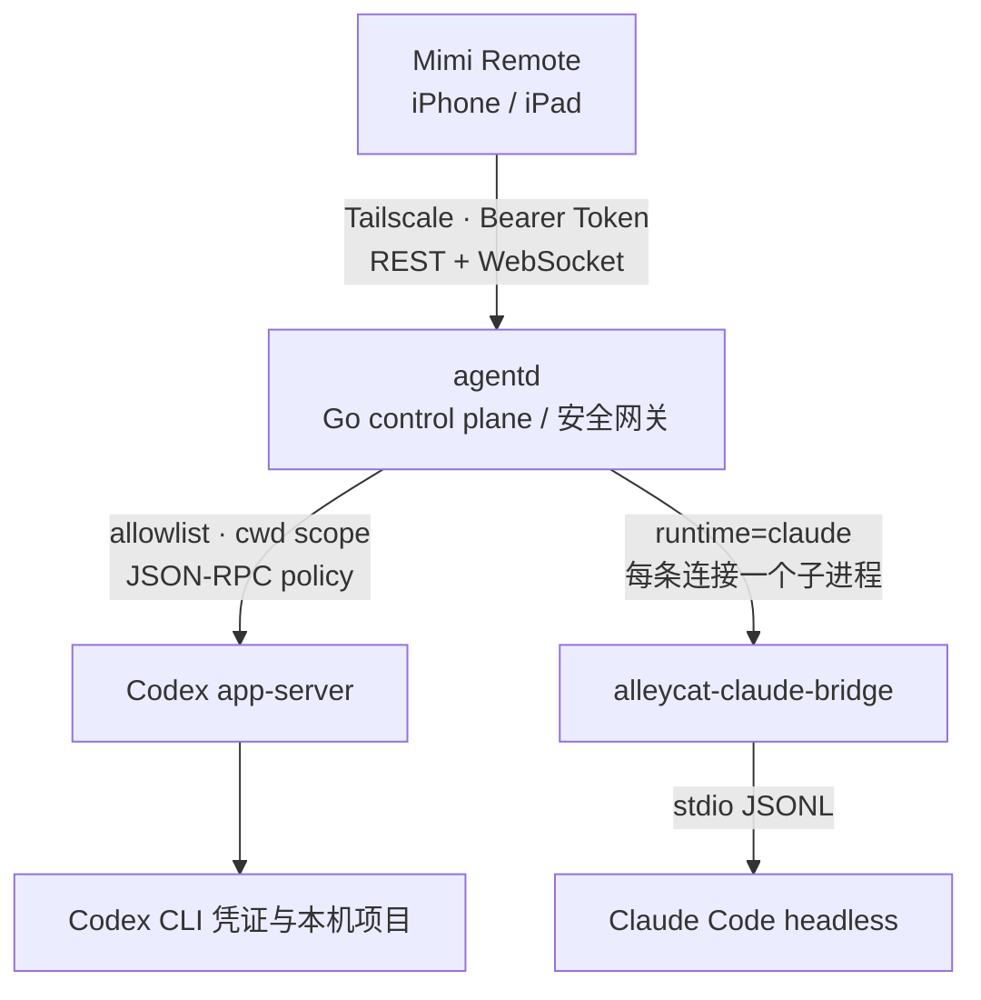

<p align="center">
  
</p>

<h1 align="center">Mimi Remote</h1>

<p align="center">
  <strong>把 Mac 上的 Codex，带到 iPhone 和 iPad。</strong>
</p>

<p align="center">
  开源、原生、本地优先的移动端 AI 编程工作台。<br />
  离开电脑后继续查看进度、补充上下文、处理审批、管理 Worktree，并完成 Git 收尾。
</p>

<p align="center">
  <a href="README.md">English README</a>
  &nbsp;·&nbsp;
  <a href="#快速开始">快速开始</a>
  &nbsp;·&nbsp;
  <a href="#架构">工作原理</a>
  &nbsp;·&nbsp;
  <a href="#常见问题faq">常见问题</a>
</p>

<p align="center">
  <a href="ios/MimiRemote/README.md"></a>
  <a href="ios/MimiRemote"></a>
  <a href="https://github.com/gaixianggeng/codex-ipad-agent/actions/workflows/go-ci.yml"></a>
  <a href="LICENSE"></a>
</p>

<p align="center">
  
</p>

Mimi Remote 通过 Tailscale 连接用户自己 Mac 上的 `agentd`，在明确授权的工作区内使用 Codex；Claude Code 通过仓库内的可选 Rust bridge 作为实验通道接入。代码、Codex / Claude 凭证和完整会话都留在用户自己的设备上，不经过项目维护者的服务器。

> Mimi Remote 是独立开发的第三方客户端，不隶属于 OpenAI、Anthropic 或 Tailscale，也不代表这些公司的官方产品。当前没有公开 App Store 版本，需要从源码构建；内部 TestFlight 不是公开下载渠道。

## 产品界面

<table>
  <tr>
    <td width="50%" align="center">
      <strong>浅色清晰，深色专注</strong><br />
      <sub>从项目、新建会话到最近任务，都跟随系统外观自然切换。</sub>
    </td>
    <td width="50%" align="center">
      <strong>同一套原生信息层级</strong><br />
      <sub>主题变化不改变操作路径，常用动作始终留在手边。</sub>
    </td>
  </tr>
  <tr>
    <td width="50%" valign="top" align="center">
      
    </td>
    <td width="50%" valign="top" align="center">
      
    </td>
  </tr>
  <tr>
    <td width="50%" align="center">
      <strong>会话控制不离开上下文</strong><br />
      <sub>模型、推理强度、Skill、速度和权限模式都在输入框上方完成。</sub>
    </td>
    <td width="50%" align="center">
      <strong>iPad 宽屏容纳完整工作区</strong><br />
      <sub>项目、最近会话和快捷操作同时可见，减少页面来回切换。</sub>
    </td>
  </tr>
  <tr>
    <td width="50%" valign="top">
      
    </td>
    <td width="50%" valign="top">
      
    </td>
  </tr>
</table>

本节截图由维护者从日常使用的 TestFlight 构建中提供。发布前仅把个人文件路径替换为 `/Users/demo/...`，未展示访问 Token 或 Tailnet 地址。完整处理说明见 [截图清单](artifacts/app-screenshots/manifest.md)。

## 为什么用 Mimi Remote

Mimi Remote 不是通用 SSH 终端，也不是把桌面网页缩到手机里。它针对移动端操作 Codex 和 Claude Code 的高频场景做了原生交互：

- **离开电脑后继续 AI 编程**：在 iPhone / iPad 上查看进度、补充上下文、steer 或 interrupt 当前任务。
- **原生 Review 与审批**：阅读 Markdown、检查 diff、处理工具审批，不必在手机终端里辨认大量转义字符。
- **完整 Git 闭环**：支持 stage、unstage、revert、commit、push 和草稿 PR，适合在移动端完成最后一步。
- **本地优先、自托管**：App 只连接你自己的 Mac；项目不提供中转云，也不代管代码、会话或 AI 凭证。
- **同时面向 Codex 与 Claude Code**：Codex 是稳定主通道，Claude Code 通过独立 bridge 实验接入。

## 能做什么

- 原生 iPhone / iPad SwiftUI 工作台，支持深浅色、主题、字体和自适应布局。
- Codex 会话列表、搜索、新建、恢复、流式输出、steer、interrupt、审批、目标、Review、fork 和 archive。
- Managed Worktree 创建、分支选择、受保护删除和人工清理。
- Git status、diff、文件与 hunk 级 stage/unstage/revert、commit、push 和草稿 PR。
- 图片、富 Markdown、语音转写、文件安全读取和 Quick Look。
- 多台 Mac 档案，每台使用独立 Keychain Token；同一时间只连接一台。
- Doctor、readyz、弱网恢复、协议漂移检查和安装/回滚工具。
- 可选 Claude Code 实验通道，共用同一套移动端会话和审批界面。

当前不做云端账号、代码托管、公网中继、任意远程 Shell、后台无人值守删除或多用户共享。完整边界见 [项目现状](docs/project-status.md)。

## 架构



安全边界：

- iOS 只保存访问 `agentd` 的外侧 Token，Token 存在 Keychain。
- `agentd` 只允许配置中的项目、`browse_roots` 和受管 Worktree。
- Codex app-server capability token 只保存在 Mac 的 loopback 环境。
- 远程命令只允许执行配置中的 action，并带确认、超时和输出上限。
- 默认只建议通过 Tailscale 私网访问，不建议把 `agentd` 暴露到公网。

### Claude Code 为什么需要单独 bridge

Claude bridge 位于本仓库 [`bridges/claude`](bridges/claude)，与 iOS 和 `agentd` 共用版本、CI 和发布入口。`agentd` 为每条 Claude WebSocket 启动一个 `alleycat-claude-bridge` 子进程，把 iOS 使用的 app-server JSON-RPC 转成 Claude Code headless 的 stdio JSONL。

该通道默认关闭并标记为实验功能：断网、锁屏或 WebSocket 结束会终止对应 bridge，正在执行的 turn 可能中断；`goal`、`archive` 和 `fork` 尚未开放。详细生命周期、权限和失败模式见 [Claude bridge 架构](docs/claude-bridge-architecture.md)。

## 快速开始

> 新的菜单栏宿主 App 正在本地 Beta 阶段：它把 `agentd`、配对、状态、Doctor 和 Homebrew 迁移集中到一个原生界面，开发构建说明见 [Mimi Remote Mac](macos/MimiRemoteMac/README.md)。公开安装仍以本节的 Homebrew 方式为准。

### 1. Mac 安装

要求：

- 已安装并登录 Codex CLI；
- Mac 与 iPhone / iPad 已加入同一个 Tailscale 网络；
- macOS 已安装 Homebrew。

```bash
brew update
brew install gaixianggeng/tap/mimi-remote

codex --version
codex app-server --help
agentd up
```

`agentd up` 会生成用户私有配置和两层独立 Token，启动后台服务，等待真实 app-server WebSocket 就绪，然后在终端显示短期配对二维码。

常用命令：

```bash
agentd status
agentd pair
agentd doctor --fix
agentd logs -n 200
agentd up --no-pair
agentd restart
agentd restart --no-pair
agentd stop
```

`agentd restart` 在 macOS 上使用 launchd 原子重启，允许从当前服务托管的远程任务安全触发；不要在这类任务中直接运行 `brew services restart mimi-remote`。
Agent、自动化或远程日志场景使用 `agentd up --no-pair` / `agentd restart --no-pair`，避免把二维码、Endpoint 和长期访问码写入任务输出。`agentd up --no-pair --json` 只返回版本、就绪状态和安全警告，不包含完整 setup 结果；需要配对时再由用户在本机终端运行 `agentd pair --qr-only`。

Linux 使用 Release 归档中的 user-systemd 安装脚本，完整步骤见 [安装、升级与回滚](docs/install-upgrade-rollback.md)。

### 2. 安装 iOS App

公开 App Store 版本尚未发布。目前可以从源码构建：

```bash
xcodegen generate \
  --spec ios/MimiRemote/project.yml \
  --project ios/MimiRemote

open ios/MimiRemote/MimiRemote.xcodeproj
```

在 Xcode 中选择 `MimiRemote` scheme、开发者 Team 和目标 iPhone / iPad 后运行。工程要求 iOS / iPadOS 26 或更高版本。

首次启动时扫描 `agentd up` 或 `agentd pair` 显示的二维码。二维码使用短期、单次兑换票据，不直接包含长期 Token；扫码不可用时可以展开高级手动连接。

## Claude Code 实验通道

当前要求 `alleycat-claude-bridge >= 0.2.1`。bridge 已并入当前仓库，可以直接从同一个 GitHub 地址安装：

```bash
cargo install --git https://github.com/gaixianggeng/codex-ipad-agent.git \
  --locked --force --bin alleycat-claude-bridge alleycat-claude-bridge

command -v alleycat-claude-bridge
```

在用户配置中显式启用：

```json
{
  "claude": {
    "enabled": true,
    "bridge_bin": "/opt/homebrew/bin/alleycat-claude-bridge",
    "args": [],
    "max_concurrent_bridges": 3,
    "env": {
      "TERM": "xterm-256color"
    }
  }
}
```

然后验证：

```bash
agentd restart
agentd doctor

go run ./scripts/ipad-ws-probe.go \
  -endpoint http://127.0.0.1:8787 \
  -token "$AGENTD_TOKEN" \
  -cwd "$PWD" \
  -runtime claude \
  -models-only
```

## 从源码开发

### Go 后端

要求 Go `1.25.0`：

```bash
go test ./...
go vet ./...

# 前台调试，不替换 Homebrew 服务
go build -trimpath -o bin/agentd ./cmd/agentd
./bin/agentd setup --scan-root "$HOME/code" --browse-root "$HOME"
./bin/agentd serve
```

已经通过 Homebrew 运行 `agentd` 时，不要把未签名的 `go build` 产物直接覆盖到 Cellar。macOS 会把 Go 的 ad-hoc 签名绑定到本次构建的 `cdhash`，下一次编译后可能重新请求“文件与文件夹”或“完全磁盘访问”授权。使用仓库内的完整开发重启入口：

```bash
# 本机终端：等待新服务通过 readyz
bash ./scripts/restart-agentd-dev-macos.sh

# 从 iPad/Codex 远程发起：先交给独立 launchd job，再让旧连接退出
bash ./scripts/restart-agentd-dev-macos.sh --no-wait

# 重连后查看结果；失败会自动恢复旧二进制
bash ./scripts/restart-agentd-dev-macos.sh --status
```

脚本使用本机 `Apple Development` 证书和固定 identifier 签名，原子替换 Homebrew 二进制，通过独立 launchd job 执行 kickstart、`readyz` 验证和失败回滚。新进程会在启动最前面异步预检项目、`scan_roots`、`browse_roots`；当 `browse_roots` 覆盖当前 Home 时，还会主动探测 Desktop、Documents、Downloads，尽早触发 macOS 的“文件与文件夹”提示。预检不会递归读取文件，也不会因等待人工点击而阻塞远程服务恢复；结果显示在 `agentd status --json` / Doctor 和服务日志中。

macOS 没有可由后台服务自动申请的“整个当前用户目录”单一授权：Desktop、Documents、Downloads 是分开的保护位置，其他 App 数据等还需要“完全磁盘访问”。第一次从旧 ad-hoc 版本切换到稳定签名时仍可能要求最后一次人工确认；真正需要无人值守访问整个 Home 时，请在“系统设置 → 隐私与安全性 → 完全磁盘访问”中一次性添加 `/opt/homebrew/opt/mimi-remote/bin/agentd`。同一证书和 identifier 下的后续本地构建可以复用授权。详细设计和排障见 [安装、升级与回滚](docs/install-upgrade-rollback.md)。

### iOS

```bash
xcodegen generate \
  --spec ios/MimiRemote/project.yml \
  --project ios/MimiRemote

xcodebuild \
  -project ios/MimiRemote/MimiRemote.xcodeproj \
  -scheme MimiRemote \
  -configuration Debug \
  -sdk iphoneos \
  CODE_SIGNING_ALLOWED=NO \
  build-for-testing
```

iOS 工程结构、Catalyst 和真机验收见 [iOS 开发说明](ios/MimiRemote/README.md)。

### Claude bridge

```bash
cargo test --locked \
  -p alleycat-codex-proto \
  -p alleycat-bridge-core \
  -p alleycat-claude-bridge

cargo install --locked \
  --path bridges/claude/crates/claude-bridge \
  --force \
  --bin alleycat-claude-bridge
```

bridge 只保留 Mimi Remote 需要的三个 crate；上游来源和 GPLv3-only 边界见 [Claude bridge 说明](bridges/claude/README.md)。

## 验证

提交前至少运行：

```bash
go test ./... -count=1
go vet ./...
bash ./scripts/check-codex-protocol.sh
bash ./scripts/check-public-repo-safety.sh
bash ./scripts/check-third-party-notices.sh
bash ./scripts/check-ios-privacy-manifest.sh
bash ./scripts/restart-agentd-dev-macos.sh --self-test
bash ./scripts/verify-release.sh
cargo test --locked -p alleycat-claude-bridge
```

正式 macOS Release 必须通过 Developer ID 签名和 Apple notarization；发布链路另外包含签名凭据预检、Darwin 归档身份校验、打包、Linux 安装、Git 历史凭据扫描、Action SHA 固定和协议漂移门禁，详见 [P0 / P1 发布清单](docs/p0-p1-roadmap.md)。

## 仓库说明

- 本仓库 `gaixianggeng/codex-ipad-agent`：完整开源源码，包括 iOS App、Go `agentd`、Claude bridge、测试、文档和本地发布脚本。
- [gaixianggeng/mimi-remote](https://github.com/gaixianggeng/mimi-remote)：后端公开发布镜像，承载 Go Release 和 Homebrew 下载链路。

源码目录保持语言和职责清晰，同时避免为目录整齐大规模改写稳定构建路径：

```text
ios/MimiRemote/          SwiftUI iPhone / iPad App
cmd/agentd/ + internal/  Go 安全网关与 Codex / Claude 控制面
bridges/claude/          Rust Claude Code 协议 bridge
```

保留后端发布镜像是为了不破坏已有 Homebrew / Release URL；日常功能开发以本仓库为准，后端镜像由白名单脚本单向导出。

## 常见问题（FAQ）

### Can I use Codex on an iPad or iPhone? / 可以在 iPad 或 iPhone 上使用 Codex 吗？

可以。Codex CLI 和工作区仍运行在你的 Mac 上，Mimi Remote 通过 `agentd` 提供原生移动端界面。它是 Codex 的 iPhone / iPad 远程客户端，不是在 iOS 沙盒内直接运行完整 CLI。

### Is Mimi Remote self-hosted and local-first? / 这是自托管、本地优先的吗？

是。移动端通过 Tailscale 访问你自己的 `agentd`，项目维护者不运营中转服务。源代码、会话、日志以及 Codex / Claude 凭证留在你的设备上。

### Does it support Claude Code? / 支持 Claude Code 吗？

支持实验通道。`agentd` 可以调用仓库内的 [Claude bridge](bridges/claude)，把同一套移动端会话与审批界面连接到 Claude Code headless。该能力默认关闭，功能边界见 [Claude bridge 架构](docs/claude-bridge-architecture.md)。

### Is this an official OpenAI or Anthropic app? / 这是官方 App 吗？

不是。Mimi Remote 是采用 GNU GPLv3 并附 App Store / Google Play 分发例外的第三方开源项目，与 OpenAI、Anthropic 和 Tailscale 均无隶属或背书关系。

### Why does the app require iOS / iPadOS 26? / 为什么要求 iOS 26？

当前版本优先使用较新的 SwiftUI 能力完成原生多栏工作台、输入与材质效果，以减少兼容分支和小团队维护成本。旧系统兼容会根据真实用户需求再评估。

## 参与项目

- 遇到 Bug 或有功能建议，请创建 [GitHub Issue](https://github.com/gaixianggeng/codex-ipad-agent/issues/new)。
- 提交代码前请阅读 [贡献指南](CONTRIBUTING.md)，并尽量附上可复现步骤或验证结果。
- 如果 Mimi Remote 确实解决了你的问题，可以给仓库一个 Star；它会帮助更多正在搜索 Codex iPad client、Codex remote 或 Claude Code iOS client 的开发者找到这个项目。

## 文档

- [项目现状与关键决策](docs/project-status.md)
- [P0 / P1 发布清单](docs/p0-p1-roadmap.md)
- [安装、升级与回滚](docs/install-upgrade-rollback.md)
- [Tailscale 与 Peer Relay 运维](docs/tailscale-peer-relay-ops.md)
- [Codex 协议支持边界](docs/codex-protocol-support.md)
- [Claude bridge 架构](docs/claude-bridge-architecture.md)
- [与 Litter 的能力对照](docs/litter-comparison.md)
- [隐私政策](docs/privacy-policy.md)
- [使用条款](docs/terms-of-use.md)
- [支持说明](docs/support.md)
- [安全政策](SECURITY.md)

## 隐私与安全

Mimi Remote 不包含广告、分析 SDK 或开发者自建遥测，不把项目内容、对话、日志、代码或 Token 上传到项目维护者服务器。用户主动启用的 Codex、Claude Code、GitHub、Codex 语音转写或 MCP 等第三方能力仍受各自服务条款约束；Apple 语音输入使用设备端 SpeechAnalyzer 处理。

请不要在公开 Issue、PR、日志或截图中提交真实 Token、Tailscale IP、私有工作目录或项目内容。安全问题请按 [SECURITY.md](SECURITY.md) 私下报告。

## License

Mimi Remote 自有的 iOS App、Go 后端和文档使用 [GNU GPLv3](LICENSE)，并依据 GPLv3 第 7 节授予通过 Apple App Store 和 Google Play 分发的额外许可。商业使用并未被禁止，但分发修改版或二进制时仍须遵守 GPLv3，包括向接收者提供对应源码和同等许可。

[`bridges/claude`](bridges/claude) 源自 Alleycat 多位贡献者，保留独立的 [GPLv3-only](bridges/claude/LICENSE)；仓库根目录的商店分发额外许可不适用于这部分上游代码。

此前已经明确以 MIT License 发布的历史版本继续受其原有许可；本次变更不追溯撤销已经授予的权利。第三方版权与许可证正文见 [NOTICE.md](NOTICE.md) 和 [THIRD_PARTY_NOTICES.md](THIRD_PARTY_NOTICES.md)。
