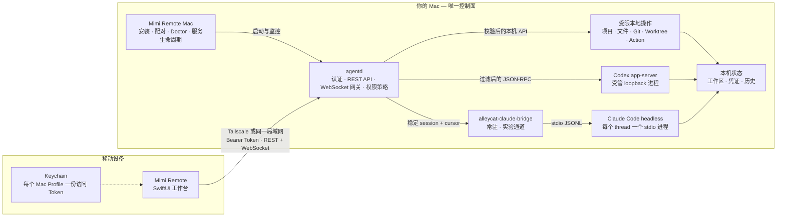

<p align="center">
  
</p>

<h1 align="center">Mimi Remote</h1>

<p align="center">
  <strong>让 Mac 继续干活，你不必一直守在 Mac 前。</strong>
</p>

<p align="center">
  开源、原生、本地优先的 Codex 移动工作台。<br />
  iPhone 看进度，iPad 补方向，iPad Pro 做 Review 和 Git 收尾。
</p>

<p align="center">
  <a href="README.md">English README</a>
  &nbsp;·&nbsp;
  <a href="#快速开始">快速开始</a>
  &nbsp;·&nbsp;
  <a href="#架构">工作原理</a>
  &nbsp;·&nbsp;
  <a href="#常见问题faq">常见问题</a>
</p>

<p align="center">
  <a href="ios/MimiRemote/README.md"></a>
  <a href="ios/MimiRemote"></a>
  <a href="https://github.com/gaixianggeng/codex-ipad-agent/actions/workflows/go-ci.yml"></a>
  <a href="LICENSE"></a>
</p>

<p align="center">
  
</p>

<p align="center">
  <sub>实体 iPad Pro、当前 Debug 构建、公开演示数据；不是重绘的概念图。</sub>
</p>

Mimi Remote 通过 Tailscale 或同一局域网直连用户自己的 Mac。项目不运营中转服务、云账号或会话托管服务，Mac 始终是控制平面；用户主动发送给 Codex、Claude Code、GitHub、语音转写或 MCP 的数据，仍会按对应第三方服务的处理方式与条款处理。

Mimi Remote 是独立开发的第三方项目，不隶属于 OpenAI、Anthropic 或 Tailscale，也不代表这些公司的官方产品。Codex 是主要支持的 Runtime；可选的 Claude Code bridge 仍处于实验阶段。

> 当前还没有公开 App Store 版本，需要从源码构建 iOS App；内部 TestFlight 不是公开下载渠道。

<table>
  <tr>
    <td width="50%" align="center">
      <strong>iPhone · 随时看一眼、补一句</strong><br />
      <sub>读结果、补上下文、处理审批，或者及时停止一轮任务。</sub>
    </td>
    <td width="50%" align="center">
      <strong>iPad · 控制始终留在上下文里</strong><br />
      <sub>会话、待发送指令、模型、权限和输入区同时可见。</sub>
    </td>
  </tr>
  <tr>
    <td width="50%" valign="top" align="center">
      
    </td>
    <td width="50%" valign="top" align="center">
      
    </td>
  </tr>
</table>

三张图来自同一份当前源码，通过 Xcode Device Hub 在实体设备上采集。Debug 专用种子数据只使用 `/Users/demo`、占位凭证和公开演示文案，没有展示个人仓库、访问 Token、Endpoint 或 Tailnet 地址。完整说明见 [截图清单](artifacts/app-screenshots/manifest.md)。

## 离开工位，不离开任务

真正高频的需求通常不是“在手机上开一个终端”，而是“Agent 趁我离开时做完了——我想看懂它改了什么，再决定下一步”。

- **看一眼：**任务是在思考、等待、失败，还是已经完成，不用重新打开 Mac。
- **补一句：**追加上下文、排队下一条指令、切换模型或推理强度、回答问题、批准操作或中断当前 Turn。
- **收个尾：**检查状态和 Diff、管理 Worktree、按文件或 Hunk 暂存、Commit、Push，并创建 Draft PR。

iPhone 保持紧凑、适合触屏；到了 iPad，同一套原生 SwiftUI 界面会展开成项目、会话、正文与 Inspector 工作台，而不是简单把手机页面拉宽。

## 它不是口袋里的终端

- Codex 的消息、推理、命令、Tool 调用、审批和执行过程会组成结构化时间线，不是一整屏终端日志。
- 新建 Codex 会话由 Mac 端异步生成简短标题；生成失败不会阻塞对话，可通过 `app_server.auto_title` 关闭。
- 模型、推理强度、Skill、速度、权限模式和待发送队列都留在 Composer 附近。
- Markdown、图片、文件引用、语音输入和安全的 Quick Look 读取都按移动端内容呈现。
- Worktree 与 Git 操作带预览、确认、超时和输出上限，不向手机暴露不受控的任意 Shell。
- 多个 Mac Profile 使用独立 Keychain Token；同一时间只保持一个活动连接，心智模型更简单。
- 就绪检查、断线恢复、Doctor 和有上限的日志导出，让多数故障不必回到电脑前处理。

当前不做云端账号、代码托管、公网中继、任意远程 Shell、后台无人值守删除或多用户共享。完整边界见 [项目现状](docs/project-status.md)。

## 设计围绕上下文，不围绕屏幕尺寸

Mimi Remote 在不同设备上沿用同一套项目与会话模型，但界面会顺着设备的真实使用方式变化：iPad 是保留上下文的工作台，Mac 是紧凑的运行控制面，不会把同一张页面机械复制到所有端。

<table>
  <tr>
    <td width="50%" align="center">
      <strong>项目是一级对象</strong><br />
      <sub>项目状态、快捷启动和最近会话组成一个连续工作区。</sub>
    </td>
    <td width="50%" align="center">
      <strong>打开设置也不丢上下文</strong><br />
      <sub>额度、连接、语言、外观和权限叠加在当前工作台上。</sub>
    </td>
  </tr>
  <tr>
    <td width="50%" valign="top" align="center">
      
    </td>
    <td width="50%" valign="top" align="center">
      
    </td>
  </tr>
</table>

<p align="center">
  
</p>

<p align="center">
  <sub>340pt 的 Mac 菜单栏窗口把宿主健康状态、Codex / Claude 运行时、额度环、配对、诊断和恢复动作放在一次点击内。</sub>
</p>

这套层级有几个明确原则：

- **保留上下文：**iPad 侧栏持续展示项目和会话，右侧内容按任务变化；设置使用 Sheet，工作台不会突然消失。
- **渐进披露复杂度：**高频状态和动作靠近任务，首次设置、配对、诊断和深层偏好进入独立界面。
- **先看状态，再做动作：**连接健康度、Runtime 就绪状态、剩余额度和权限模式会先于可能改变或中断任务的控制项出现。
- **遵循各平台习惯：**iPhone 是紧凑触屏层级，iPad 是多栏工作台，Mac 是高密度菜单栏工具，而不是把一套布局拉伸到三块屏幕。

两张 iPad 细节图来自当前 Debug 构建和复用的 iPad Pro 模拟器；Mac 图来自同一份源码的 Debug 专用种子界面，并使用公开演示域名 `mimi-demo.local`。采集过程没有重启或替换已安装的 Mac 服务。完整记录见 [截图清单](artifacts/app-screenshots/manifest.md)。

## 架构


```mermaid
flowchart LR
    subgraph Mobile["移动设备"]
        App["Mimi Remote<br/>SwiftUI 工作台"]
        Keychain["Keychain<br/>每个 Mac Profile 一份访问 Token"]
        Keychain -.-> App
    end

    subgraph Mac["你的 Mac — 唯一控制面"]
        Host["Mimi Remote Mac<br/>安装 · 配对 · Doctor · 服务生命周期"]
        Agent["agentd<br/>认证 · REST API · WebSocket 网关 · 权限策略"]
        Local["受限本地操作<br/>项目 · 文件 · Git · Worktree · Action"]
        Codex["Codex app-server<br/>受管 loopback 进程"]
        Bridge["alleycat-claude-bridge<br/>常驻 · 实验通道"]
        Claude["Claude Code headless<br/>每个 thread 一个 stdio 进程"]
        State["本机状态<br/>工作区 · 凭证 · 历史"]

        Host -->|"启动与监控"| Agent
        Agent -->|"校验后的本机 API"| Local
        Agent -->|"过滤后的 JSON-RPC"| Codex
        Agent -->|"稳定 session + cursor"| Bridge
        Bridge -->|"stdio JSONL"| Claude
        Local --> State
        Codex --> State
        Claude --> State
    end

    App -->|"Tailscale 或同一局域网<br/>Bearer Token · REST + WebSocket"| Agent
```

Mimi Remote 是原生客户端，不是另一台运行 Agent 的主机。所有远程请求都终止在你 Mac 上的 `agentd`；iOS 不会直接连接 Codex app-server、Claude Code、本机文件系统或项目维护者提供的云服务。

系统有三条清晰的调用路径：

1. **宿主生命周期：**Mimi Remote Mac 负责安装、配对、诊断、启动和监控 `agentd`，不经过每一条业务请求。命令行和 Linux 场景可以由 Homebrew 或 user-systemd 运行同一个 Go 服务。
2. **受限本机能力：**项目发现、安全文件读取、Git、受管 Worktree、诊断、语音代理和配置 Action 都通过 `agentd` 的认证 REST API 完成，不需要绕经 Codex。
3. **Agent 会话：**移动端只连接一个对外的 Codex-compatible JSON-RPC / WebSocket 网关。`agentd` 校验 runtime、method、由项目映射得到的工作目录、Payload 大小和连接预算，再把请求路由到主通道 Codex app-server 或实验通道 Claude bridge。

Codex app-server 是由 `agentd` 管理的 loopback 进程，也是默认运行时。可选的常驻 Claude bridge 使用稳定 session key 和 replay cursor 承接移动端重连，并为每个活动 thread 管理一个 Claude Code headless stdio 进程。Provider 差异被限制在适配层内；移动端共用界面不代表两条通道功能完全一致。

安全边界集中在 Mac：

- 二维码只携带短期、单次使用的配对票据；换取到的长期 `agentd` Token 按 Mac Profile 保存到 Keychain。
- app-server capability token 与 Provider 凭证不会离开 Mac；受管 app-server 只监听 loopback。
- 客户端提交的项目 ID 必须通过配置中的项目 allowlist 解析；文件访问限制在项目根目录、`browse_roots` 和受管 Worktree。
- Git 与 Worktree API 只暴露固定、经过参数校验的操作；通用命令必须预先配置为 Action，并受确认、超时、请求大小和输出上限约束。
- 正常断线后通过 sequence / cursor 回放实时事件；超出回放窗口时读取本机权威历史，不会重新提交同一个 Turn。
- 跨网络默认推荐 Tailscale；未安装时可在同一局域网直连。两种方式都不应把 `agentd` 暴露到公网。

这套架构部署简单、边界可审计，但代价也很明确：Mac 必须保持唤醒并能从私有网络访问，`agentd` 与所选 Runtime 也必须健康。当前没有维护者运营的中继、云端状态同步或 APNs 后台执行链路。

### Claude Code 为什么需要单独 bridge

Claude bridge 位于本仓库 [`bridges/claude`](bridges/claude)，与 iOS 和 `agentd` 共用版本、CI 和发布入口。`agentd` 监督一个常驻 bridge，通过稳定 session key 把多次移动端 WebSocket 连接附着到同一运行时；每个 Claude thread 对应一个 Claude Code headless stdio JSONL 进程。

该通道默认关闭并标记为实验功能。普通断线不会重新提交 `turn/start`，重连优先回放缺失事件，超出窗口时读取本机 Claude 历史；bridge 或 Mac 重启前尚未落盘的极短窗口仍可能丢失。`goal`、`archive` 和 `fork` 尚未开放，详细生命周期、权限和失败模式见 [Claude bridge 架构](docs/claude-bridge-architecture.md)。

## 快速开始

推荐使用已经 Developer ID 签名并经过 Apple 公证的菜单栏宿主 App。它把 `agentd`、配对、状态、Doctor 和 Homebrew 迁移集中到一个原生界面；Homebrew 保留给命令行、服务器、自动化和故障恢复。

### 1. Mac 安装

要求：

- macOS 26 或更高版本；
- 已安装并登录 Codex CLI；
- Mac 与 iPhone / iPad 位于同一私有网络；跨网络使用时建议加入同一个 Tailscale 网络。

普通用户从 [GitHub Releases](https://github.com/gaixianggeng/codex-ipad-agent/releases/latest) 下载 `Mimi-Remote-Mac.dmg` 和对应 SHA-256 文件，校验后打开 DMG，把 **Mimi Remote Mac** 拖到“应用程序”，再从菜单栏完成首次设置。App 已内置 `agentd` 和兼容的 Claude bridge，不要求 Homebrew、Go、Rust 或 Xcode。

已有 Homebrew 服务时，让 Mac App 执行接管；迁移过程会先跑 Doctor，失败时尝试恢复旧服务，并保留现有配置、Token 和配对关系。

命令行、服务器或恢复场景才使用 Homebrew：

```bash
brew update
brew install gaixianggeng/tap/mimi-remote

codex --version
codex app-server --help
agentd up
```

`agentd up` 会生成用户私有配置和两层独立 Token，启动后台服务，等待真实 app-server WebSocket 就绪，然后在终端显示短期配对二维码。检测到 Tailscale 时优先使用 Tailscale；否则自动启用局域网，并把当前私有局域网地址写入配对信息。

Homebrew / CLI 常用命令：

```bash
agentd status
agentd pair
agentd doctor --fix
agentd logs -n 200
agentd up --no-pair
agentd restart
agentd restart --no-pair
agentd stop
```

`agentd restart` 在 macOS 上使用 launchd 原子重启，允许从当前服务托管的远程任务安全触发；不要在这类任务中直接运行 `brew services restart mimi-remote`。
Agent、自动化或远程日志场景使用 `agentd up --no-pair` / `agentd restart --no-pair`，避免把二维码、Endpoint 和长期访问码写入任务输出。`agentd up --no-pair --json` 只返回版本、就绪状态和安全警告，不包含完整 setup 结果；需要配对时再由用户在本机终端运行 `agentd pair --qr-only`。

Linux 使用 Release 归档中的 user-systemd 安装脚本，完整步骤见 [安装、升级与回滚](docs/install-upgrade-rollback.md)。

如果希望由 Codex 按同一套权限最小化、可恢复流程完成安装、升级和诊断，可以让 `$skill-installer` 安装下面的 GitHub Skill 路径：

```text
https://github.com/gaixianggeng/codex-ipad-agent/tree/main/packaging/skill/install-mimi-remote
```

每个 GitHub Release 也会附带 `install-mimi-remote.zip` 和对应 SHA-256 文件，便于固定版本下载与审计。

### 2. 安装 iOS App

公开 App Store 版本尚未发布。目前可以从源码构建：

```bash
xcodegen generate \
  --spec ios/MimiRemote/project.yml \
  --project ios/MimiRemote

open ios/MimiRemote/MimiRemote.xcodeproj
```

在 Xcode 中选择 `MimiRemote` scheme、开发者 Team 和目标 iPhone / iPad 后运行。工程要求 iOS / iPadOS 26 或更高版本。

Mac App 用户从菜单栏选择“配对设备…”，CLI 用户扫描 `agentd up` 或 `agentd pair` 显示的二维码。二维码使用短期、单次兑换票据，不直接包含长期 Token；扫码不可用时可以展开高级手动连接。

## Claude Code 实验通道

Claude Runtime 默认关闭，当前要求 `alleycat-claude-bridge >= 0.2.1`。正式 Mac DMG 已经内置经过签名的兼容 bridge，不要为该安装方式重复执行 `cargo install`。

只有 Homebrew、Linux 或独立开发环境需要从源码安装外置 bridge：

```bash
cargo install --git https://github.com/gaixianggeng/codex-ipad-agent.git \
  --locked --force --bin alleycat-claude-bridge alleycat-claude-bridge

command -v alleycat-claude-bridge
```

在用户配置中显式启用：

```json
{
  "claude": {
    "enabled": true,
    "bridge_bin": "",
    "args": [],
    "max_concurrent_bridges": 3,
    "env": {
      "TERM": "xterm-256color"
    }
  }
}
```

空 `bridge_bin` 表示使用 Mimi Remote Mac 随包 bridge；Homebrew 和 Linux 必须改成 `command -v alleycat-claude-bridge` 返回的绝对路径。配置文件含长期 Token，修改前必须创建用户私有备份，只用 JSON 解析器修改 `claude` 字段，保持 `0600`，不要把完整文件打印到日志或聊天中。

然后验证：

```bash
go run ./scripts/ipad-ws-probe.go \
  -endpoint http://127.0.0.1:8787 \
  -token "$AGENTD_TOKEN" \
  -cwd "$PWD" \
  -runtime claude \
  -models-only
```

修改配置后必须从当前 service owner 重启：Mimi Remote Mac 使用菜单栏“重新启动服务”，Homebrew 使用 `agentd restart --no-pair`，Linux 使用 user-systemd。随后运行 Doctor，并在移动端确认 Runtime 选择器出现 Claude，且 Codex 主通道仍可用。上面的源码探针只用于开发仓库中的本机调试，不要把 Token 写进聊天或持久日志。

Claude 通道仍是实验能力：不支持 `goal`、`archive`、`fork`、APNs 后台推送和跨设备云同步。普通断线通过事件 replay 或 `thread/read` 恢复，不自动重试写操作；bridge/Mac 重启后的极短未落盘窗口仍可能无法恢复。

## 从源码开发

### Go 后端

要求 Go `1.25.0`：

```bash
go test ./...
go vet ./...

# 前台调试，不替换 Homebrew 服务
go build -trimpath -o bin/agentd ./cmd/agentd
./bin/agentd setup --scan-root "$HOME/code" --browse-root "$HOME"
./bin/agentd serve
```

已经通过 Homebrew 运行 `agentd` 时，不要把未签名的 `go build` 产物直接覆盖到 Cellar。macOS 会把 Go 的 ad-hoc 签名绑定到本次构建的 `cdhash`，下一次编译后可能重新请求“文件与文件夹”或“完全磁盘访问”授权。使用仓库内的完整开发重启入口：

```bash
# 本机终端：等待新服务通过 readyz
bash ./scripts/restart-agentd-dev-macos.sh

# 从 iPad/Codex 远程发起：先交给独立 launchd job，再让旧连接退出
bash ./scripts/restart-agentd-dev-macos.sh --no-wait

# 重连后查看结果；失败会自动恢复旧二进制
bash ./scripts/restart-agentd-dev-macos.sh --status
```

脚本使用本机 `Apple Development` 证书和固定 identifier 签名，原子替换 Homebrew 二进制，通过独立 launchd job 执行 kickstart、`readyz` 验证和失败回滚。新进程会在启动最前面异步预检项目、`scan_roots`、`browse_roots`；当 `browse_roots` 覆盖当前 Home 时，还会主动探测 Desktop、Documents、Downloads，尽早触发 macOS 的“文件与文件夹”提示。预检不会递归读取文件，也不会因等待人工点击而阻塞远程服务恢复；结果显示在 `agentd status --json` / Doctor 和服务日志中。

macOS 没有可由后台服务自动申请的“整个当前用户目录”单一授权：Desktop、Documents、Downloads 是分开的保护位置，其他 App 数据等还需要“完全磁盘访问”。第一次从旧 ad-hoc 版本切换到稳定签名时仍可能要求最后一次人工确认；真正需要无人值守访问整个 Home 时，请在“系统设置 → 隐私与安全性 → 完全磁盘访问”中一次性添加 `/opt/homebrew/opt/mimi-remote/bin/agentd`。同一证书和 identifier 下的后续本地构建可以复用授权。详细设计和排障见 [安装、升级与回滚](docs/install-upgrade-rollback.md)。

### iOS

```bash
xcodegen generate \
  --spec ios/MimiRemote/project.yml \
  --project ios/MimiRemote

xcodebuild \
  -project ios/MimiRemote/MimiRemote.xcodeproj \
  -scheme MimiRemote \
  -configuration Debug \
  -sdk iphoneos \
  CODE_SIGNING_ALLOWED=NO \
  build-for-testing
```

iOS 工程结构、Catalyst 和真机验收见 [iOS 开发说明](ios/MimiRemote/README.md)。

### Claude bridge

```bash
cargo test --locked \
  -p alleycat-codex-proto \
  -p alleycat-bridge-core \
  -p alleycat-claude-bridge

cargo install --locked \
  --path bridges/claude/crates/claude-bridge \
  --force \
  --bin alleycat-claude-bridge
```

bridge 只保留 Mimi Remote 需要的三个 crate；上游来源和 GPLv3-only 边界见 [Claude bridge 说明](bridges/claude/README.md)。

## 验证

提交前至少运行：

```bash
go test ./... -count=1
go vet ./...
bash ./scripts/check-codex-protocol.sh
bash ./scripts/check-public-repo-safety.sh
bash ./scripts/check-third-party-notices.sh
bash ./scripts/check-ios-privacy-manifest.sh
bash ./scripts/restart-agentd-dev-macos.sh --self-test
bash ./scripts/verify-release.sh
cargo test --locked -p alleycat-claude-bridge
```

正式 macOS Release 必须通过 Developer ID 签名和 Apple notarization；发布链路另外包含签名凭据预检、Darwin 归档身份校验、打包、Linux 安装、Git 历史凭据扫描、Action SHA 固定和协议漂移门禁，详见 [P0 / P1 发布清单](docs/p0-p1-roadmap.md)。

## 仓库说明

- 本仓库 `gaixianggeng/codex-ipad-agent`：唯一的完整开源源码与新版本发布仓库，包括 iOS App、Mac App、Go `agentd`、Claude bridge、测试、文档和发布脚本。
- [gaixianggeng/mimi-remote](https://github.com/gaixianggeng/mimi-remote)：只读历史发布归档，保留旧版本和既有下载地址。

源码目录保持语言和职责清晰，同时避免为目录整齐大规模改写稳定构建路径：

```text
ios/MimiRemote/          SwiftUI iPhone / iPad App
cmd/agentd/ + internal/  Go 安全网关与 Codex / Claude 控制面
bridges/claude/          Rust Claude Code 协议 bridge
```

新的 Mac、Go、Linux、Homebrew 和 Skill 产物统一由本仓库 Release 发布。旧仓库不再承载新版本，仅用于历史版本回滚和旧链接兼容。

## 常见问题（FAQ）

### Can I use Codex on an iPad or iPhone? / 可以在 iPad 或 iPhone 上使用 Codex 吗？

可以。Codex CLI 和工作区仍运行在你的 Mac 上，Mimi Remote 通过 `agentd` 提供原生移动端界面。它是 Codex 的 iPhone / iPad 远程客户端，不是在 iOS 沙盒内直接运行完整 CLI。

### Is Mimi Remote self-hosted and local-first? / 这是自托管、本地优先的吗？

是。移动端通过 Tailscale 或同一局域网访问你自己的 `agentd`，项目维护者不运营中转服务。源代码、会话、日志以及 Codex / Claude 凭证留在你的设备上。

### Does it support Claude Code? / 支持 Claude Code 吗？

支持实验通道。`agentd` 可以调用仓库内的 [Claude bridge](bridges/claude)，把同一套移动端会话与审批界面连接到 Claude Code headless。该能力默认关闭，功能边界见 [Claude bridge 架构](docs/claude-bridge-architecture.md)。

### Is this an official OpenAI or Anthropic app? / 这是官方 App 吗？

不是。Mimi Remote 是采用 GNU GPLv3 并附 App Store / Google Play 分发例外的第三方开源项目，与 OpenAI、Anthropic 和 Tailscale 均无隶属或背书关系。

### Why does the app require iOS / iPadOS 26? / 为什么要求 iOS 26？

当前版本优先使用较新的 SwiftUI 能力完成原生多栏工作台、输入与材质效果，以减少兼容分支和小团队维护成本。旧系统兼容会根据真实用户需求再评估。

## 参与项目

- 遇到 Bug 或有功能建议，请创建 [GitHub Issue](https://github.com/gaixianggeng/codex-ipad-agent/issues/new)。
- 提交代码前请阅读 [贡献指南](CONTRIBUTING.md)，并尽量附上可复现步骤或验证结果。
- 如果 Mimi Remote 确实解决了你的问题，可以给仓库一个 Star；它会帮助更多正在搜索 Codex iPad client、Codex remote 或 Claude Code iOS client 的开发者找到这个项目。

## 文档

- [项目现状与关键决策](docs/project-status.md)
- [P0 / P1 发布清单](docs/p0-p1-roadmap.md)
- [安装、升级与回滚](docs/install-upgrade-rollback.md)
- [Tailscale 与 Peer Relay 运维](docs/tailscale-peer-relay-ops.md)
- [Codex 协议支持边界](docs/codex-protocol-support.md)
- [Claude bridge 架构](docs/claude-bridge-architecture.md)
- [与 Litter 的能力对照](docs/litter-comparison.md)
- [隐私政策](docs/privacy-policy.md)
- [使用条款](docs/terms-of-use.md)
- [支持说明](docs/support.md)
- [安全政策](SECURITY.md)

## 隐私与安全

Mimi Remote 不包含广告、分析 SDK 或开发者自建遥测，不把项目内容、对话、日志、代码或 Token 上传到项目维护者服务器。用户主动启用的 Codex、Claude Code、GitHub、Codex 语音转写或 MCP 等第三方能力仍受各自服务条款约束；Apple 语音输入使用设备端 SpeechAnalyzer 处理。

请不要在公开 Issue、PR、日志或截图中提交真实 Token、Tailscale IP、私有工作目录或项目内容。安全问题请按 [SECURITY.md](SECURITY.md) 私下报告。

## License

Mimi Remote 自有的 iOS App、Go 后端和文档使用 [GNU GPLv3](LICENSE)，并依据 GPLv3 第 7 节授予通过 Apple App Store 和 Google Play 分发的额外许可。商业使用并未被禁止，但分发修改版或二进制时仍须遵守 GPLv3，包括向接收者提供对应源码和同等许可。

[`bridges/claude`](bridges/claude) 源自 Alleycat 多位贡献者，保留独立的 [GPLv3-only](bridges/claude/LICENSE)；仓库根目录的商店分发额外许可不适用于这部分上游代码。

此前已经明确以 MIT License 发布的历史版本继续受其原有许可；本次变更不追溯撤销已经授予的权利。第三方版权与许可证正文见 [NOTICE.md](NOTICE.md) 和 [THIRD_PARTY_NOTICES.md](THIRD_PARTY_NOTICES.md)。
