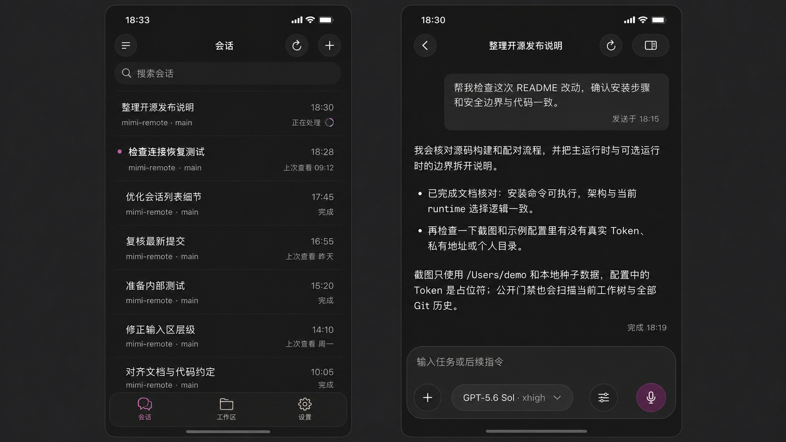
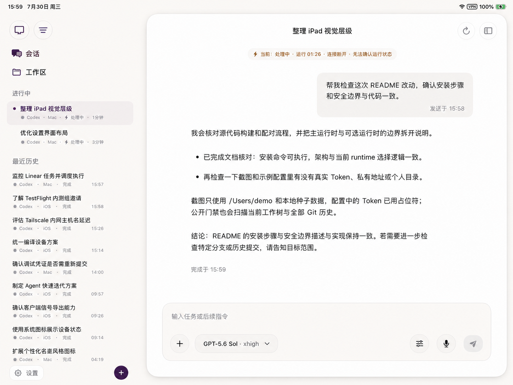
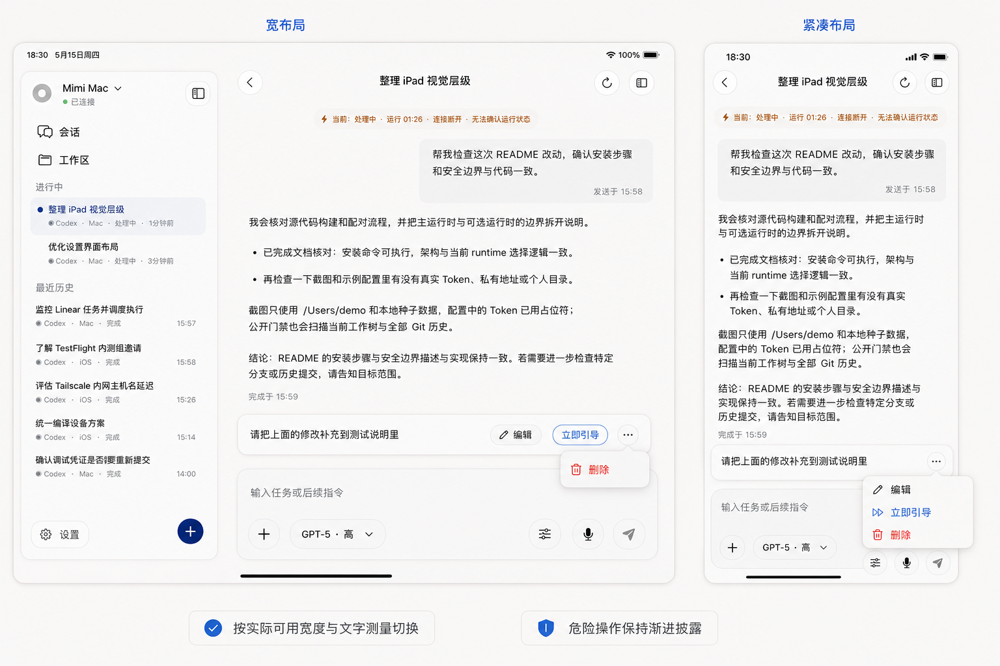

# MIM-34 会话列表与对话输入区视觉规格

> 状态：高保真视觉与交互交接稿，不包含业务代码修改。
>
> 适用范围：iOS / iPadOS 的会话列表、对话阅读层、Composer 与待发送消息操作。
>
> 设计基线：以仓库当前 SwiftUI 状态、导航和消息语义为准，视觉收口不得改变发送、排队、模型选择或会话恢复逻辑。

## 1. 目标与边界

### 1.1 目标

1. 让会话列表、对话正文和 Composer 使用同一套安静、清晰的视觉语言：背景层级少、控件形态一致、品牌色只表达操作与状态。
2. 在视觉更紧凑的同时，所有可操作项仍保留至少 `44 × 44pt` 命中区。
3. Composer 形成一个浮在内容上方的功能层：外层是唯一材质面，编辑区保持安静，底部动作有稳定顺序。
4. 模型和推理强度始终由一个胶囊表达；待发送消息则按真实可用宽度在“行内快捷动作”和“更多菜单”之间自适应。
5. iPhone、iPad 窄窗口、iPad 宽窗口切换时，不丢失选中会话、阅读位置、草稿、附件和输入状态。

### 1.2 实现边界

- 本规格不改变信息架构，不新增一级入口，也不替换现有 `UnifiedWorkbenchShell` 导航模型。
- 不修改网络、WebSocket、排队、立即引导、语音、权限、模型目录或会话恢复逻辑。
- 不引入第三方 UI 框架；优先使用 SwiftUI 原生 `Button`、`Menu`、`popover`、系统材质和辅助功能环境值。
- 不复刻其他产品的品牌、图标或装饰。概念图只用于表达层级和行为。
- 本阶段不直接修改业务代码；下文“实现落点”是后续开发任务的最小改动建议。

## 2. 方案

### 2.1 真实实现映射

| 区域 | 当前实现 | 可直接保留 | 需要收口的缺口 |
| --- | --- | --- | --- |
| 主题 | `State/ThemeStore.swift` 的 `ThemeTokens` | 浅/深色语义色、品牌色、背景、表面、边框、气泡、代码块色 | 尺寸、圆角、间距、边线、阴影散落在各 View；`uiFont` 主要按 App 自有倍率计算，并未完整跟随系统 Dynamic Type |
| 会话库与侧栏行 | `Features/Sessions/SessionListView.swift` 的 `SessionIndexRow` | library/sidebar 共用组件；选中、未读、运行时、项目、分支、时间和 44pt 最小高度语义已存在 | 两种 style 的字体、padding、间距和边框仍是局部常量；大字号时元数据没有统一的重排优先级 |
| 自适应容器 | `WorkbenchChrome.swift` 的 `WorkbenchLayout`，`Features/Shell/UnifiedWorkbenchShell.swift` | 按真实容器宽度切 compact / floating / split；`WorkbenchNavigationState` 和 `restorationRoute` 已集中持有 | 视觉改造不能在不同布局分支复制业务状态；列表滚动锚点仍需显式纳入跨布局保存方案 |
| 对话轨道 | `ConversationLayout.swift`、`ConversationView.swift` | 已按实测内容宽度计算 inset、消息宽度与 Composer 宽度；`560pt` 以下切紧凑 Composer | 视觉度量应从 `ConversationLayout` 的结构宽度中分离，避免同一数值在多处重复 |
| 用户/助手消息 | `ConversationMessageRow.swift`、`ConversationMessageBubble.swift` | 用户为中性气泡；助手普通回复已采用无气泡的文档式阅读面；时间戳、失败/发送状态语义已存在 | 用户气泡、系统卡、时间戳、行距和阴影尚未共享一套结构 Token |
| Markdown | `MarkdownStyle.swift`、`MarkdownBlockView.swift` | 正文、标题、代码、引用、表格、计划卡已有完整渲染层级 | 固定字号乘 App 倍率不能替代 Dynamic Type；代码/表格/计划卡圆角和内距需要统一命名 |
| Composer | `ComposerView.swift`、`ComposerInputExtensions.swift`、`ComposerVoiceSupport.swift` | 已是“透明 dock + 单一外层材质”；iPhone 收起/展开共用稳定工具栏；按钮有 44pt 命中区和按压反馈 | 卡片、待发送托盘、控制表面分别写死圆角与间距；未统一处理 Increased Contrast 和大字号重排 |
| 模型与推理 | `ComposerView.modelPickerControl`、`ModelReasoningGridPicker.swift` | 当前已经是单一触发器，完整值通过 `accessibilityValue` 提供，popover 在紧凑环境适配为 sheet | 需要把“单胶囊”写成不可回退的视觉规则，并统一截断和最小宽度策略 |
| 待发送消息 | `ComposerView.queuedTurnTray` / `queuedTurnRow` | 编辑、立即引导、确认重试、删除的业务动作与禁用条件已经存在 | 当前所有动作都在 36pt 省略号菜单中；缺少宽屏快捷动作和基于文字实测的稳定切换算法 |
| 现有验证 | `ConversationSnapshotTests.swift`、`SkillModelPickerSnapshotTests.swift`、`ConversationComposerSubmissionAndPendingInputTests.swift` | 已覆盖多档 iPad / iPhone 宽度、深浅色、模型选择器和部分可访问字号 | 缺少本次视觉 Token、待发送动作宽窄切换、四类辅助功能降级和跨容器状态保持矩阵 |

结论：现有业务边界和大部分结构已经正确。MIM-34 的最小方案是补一层共享视觉 Token、替换局部魔法数、增加待发送动作布局解析器和验收用例，而不是重写会话或 Composer。

### 2.2 视觉资产与阅读方式

#### iPhone：会话列表与 Composer



- 会话列表强调标题、项目与当前状态，分割和背景保持中性。
- 对话正文以阅读为主；用户内容用中性气泡区分，助手回复不再套大卡片。
- Composer 只保留一个外层功能表面，模型与推理强度合并为单胶囊。

仓库路径：`docs/design/assets/mim-34-iphone-list-composer.png`

#### iPad：浮动会话侧栏


- 左侧会话列表是可持续扫描的导航面，右侧阅读区保持平静连续。
- 侧栏、正文和 Composer 的表面层级必须有主次，不能多层半透明互相叠加。
- 侧栏形态仍由现有 `WorkbenchLayout` 决定，本规格不新增布局断点。

仓库路径：`docs/design/assets/mim-34-ipad-sidebar.png`

#### iPad：浮动详情面



- 大屏通过留白、文字行长和单一详情面建立阅读焦点，不靠大面积品牌色。
- Composer 始终贴近当前会话，底部动作顺序稳定。
- 概念图中的外形不要求像素级复刻，实际 safe area、导航栏和检查器以系统容器为准。

仓库路径：`docs/design/assets/mim-34-ipad-detail.png`

#### 待发送消息：宽/窄动作切换



- 宽布局：行尾直接展示“编辑”“立即引导”和省略号；删除只在省略号菜单中。
- 紧凑布局：行尾只保留省略号，菜单依次展示“编辑”“立即引导”、恢复动作（若有）和“删除”。
- 切换依据是当前行的真实可用宽度与本地化文字实测，不依据 iPhone / iPad 名称。

仓库路径：`docs/design/assets/mim-34-queued-actions-adaptive.png`

### 2.3 集中视觉 Token

后续实现建议把颜色语义继续留在 `ThemeTokens`，新增轻量 `ConversationVisualMetrics` 和由环境派生的 `ConversationVisualStyle`。这样不会把颜色主题和结构尺寸混成一个大对象，也不会为一次视觉收口引入新的状态层。

#### 颜色与材质

| Token | 来源 / 默认值 | 使用规则 |
| --- | --- | --- |
| `canvas` | `tokens.background` | 页面和安全区唯一底色 |
| `contentSurface` | `tokens.surface` 或现有 `contentPanelBackground` | 普通内容面、宽屏详情面；不与材质叠加 |
| `elevatedSurface` | `tokens.elevatedSurface` | Reduce Transparency 回退、菜单内状态卡、输入控件的安静键面 |
| `floatingMaterial` | `.thinMaterial` + `elevatedSurface` 的轻覆盖 | 仅用于 Composer、待发送托盘等浮动功能层；大块正文不使用 |
| `selectionFill` | `tokens.selectionFill` | 会话选中背景；同时保留 3pt 选中标记，不能只靠色差 |
| `primary/secondary/tertiaryText` | 现有同名 Token | 标题/正文、元数据、时间戳三级层级 |
| `interactive` | `tokens.primaryAction` / `tokens.accent` | 主要操作、焦点和活动状态；不用于大面积背景 |
| `hairline` | `tokens.border.opacity(0.58)` | 普通边线；Increased Contrast 改为 `tokens.border` |
| `status` | `warning` / `success` / 运行状态 tint | 必须同时配图标或文字，不以颜色作为唯一信息 |

材质层级约束：`canvas → contentSurface → floatingMaterial` 最多三层。Composer 内的文本区保持透明，工具按钮使用实色/轻填充，不再在材质卡内部叠第二块玻璃。

#### 尺寸、圆角、边线与阴影

| Token | 建议值 | 适用位置 |
| --- | ---: | --- |
| `hitTarget` | `44` | 所有按钮、菜单触发器、行内快捷动作 |
| `controlVisualHeight` | `36` | 位于 44pt 命中区内的可见键面，等价于现有四周 4pt inset |
| `sidebarRowMinHeight` | `44` | iPad 浮动侧栏会话行 |
| `libraryRowMinHeight` | `52` | iPhone / 会话库双行信息；大字号时只增高不缩字 |
| `queuedRowMinHeight` | `44` | 待发送消息单行与动作区 |
| `radiusInner` | `8` | 代码块、计划卡、小附件面 |
| `radiusControl` | `12` | 有文字的胶囊式按钮、会话行、文件卡 |
| `radiusSubpanel` | `14` | 待发送托盘、状态托盘 |
| `radiusMessage` | `18` | 用户消息气泡、宽屏导航表面 |
| `radiusComposer` | `20` | Composer 外层唯一主表面 |
| `radiusIconControl` | `22` | 44pt 圆形或无文字按钮 |
| `borderFloating` | `0.75` | Composer、待发送托盘普通边线 |
| `borderContent` | `1` | 用户气泡、系统卡、选中会话行 |
| `shadowContent` | 浅色 `black 0.04 / r2 / y1`；深色 `black 0.12 / r2 / y1` | 只用于确实浮起的用户气泡等小表面；助手文档无阴影 |
| `shadowFloating` | 浅色 `black 0.06 / r12 / y4`；深色 `black 0.18 / r16 / y6` | 仅当 Composer/浮动详情需要从复杂内容中分离；纯色背景下可降为无阴影 |

Increased Contrast 下边线统一提升到至少 1pt 且使用完整 `tokens.border`；Reduce Transparency 下不依赖阴影或模糊来分层。

#### 间距阶梯

只允许 `4 / 6 / 8 / 10 / 12 / 14 / 16 / 20 / 24pt` 九档：

- `4–6`：图标与短状态、紧凑元数据。
- `8–10`：同一行控件、列表行内部、待发送消息内部。
- `12–14`：Composer 分组、用户气泡内距、列表轨道内距。
- `16–20`：页面横向轨道、区块之间。
- `24`：宽屏阅读区的外侧留白。

### 2.4 会话列表规格

#### 信息优先级

1. 会话标题：第一优先级，选中时 `semibold`，其余 `medium`。
2. 当前运行/未读/异常：第二优先级，使用图标 + 文字或明确 VoiceOver value。
3. 项目、时间：第三优先级，在尾部保持稳定对齐。
4. 分支、只读、提醒等补充信息：空间不足时先压缩或转入下一行，不允许挤掉标题和主要状态。

#### 两种密度

| 模式 | 标题 | 元数据 | 行内布局 |
| --- | --- | --- | --- |
| `sidebar` | 约 14–15pt，单行 | 约 10–11pt，单行 | 最小 44pt；上下 5–6pt；标题与元数据间 3–4pt |
| `library` | 约 16pt，默认单行 | 约 12pt；搜索摘要可两行 | 最小 52pt；上下 8pt；标题与元数据间 6pt |

- 视觉紧凑不等于缩小命中区。整行 `contentShape(Rectangle())`，按钮/链接语义由外层保留。
- 选中态使用 `selectionFill + 3pt leading marker`；hover 只作为附加反馈，不作为选中信息。
- 正在运行的会话只允许小面积状态色；禁止整行染成紫色或警告色。
- 分割优先依靠 8–12pt 的行间节奏和轻边线，不添加卡片套卡片。
- 大字号时标题允许两行、行高自然增长；低优先级元数据可换行或隐藏，禁止把标题缩放到不可读。

### 2.5 对话阅读层规格

#### 角色和表面

- 用户普通消息：右对齐中性气泡，`radiusMessage = 18`，水平 14pt、垂直 10pt；品牌色不做大面积气泡填充。
- 助手普通回复：左对齐文档式内容，不加大气泡、描边或阴影。长文依靠最大行宽、段距和标题层级阅读。
- 系统通知：居中小胶囊；运行摘要、计划和工具状态使用紧凑结构卡，不与普通助手正文混淆。
- 图片与文件：媒体可脱离用户文字气泡；加载/失败状态使用中性表面，不能继承用户气泡语义色。

#### 文字层级

| 内容 | 基准 | 规则 |
| --- | --- | --- |
| 正文 | 16pt，行距 4pt | 跟随系统 Dynamic Type 和 App 字号倍率，只缩放一次 |
| H1 / H2 / H3 | 22 / 20 / 18pt | H1/H2 bold，H3 semibold；大字号下允许自然换行 |
| 代码 | 14pt monospaced | 保留横向滚动，不压缩代码字符 |
| 时间戳 / 发送状态 | 11–12pt medium | 使用 tertiary/secondary text；估算时间同时给 warning 语义 |
| 块间距 | 10pt | 段落、列表、引用、代码块统一节奏 |

`ThemeStore.fontScale` 是用户的 App 内偏好，不应替代系统 Dynamic Type。后续实现应以语义 text style 或 `UIFontMetrics` 获取系统字号，再乘受控的 App 倍率，避免 SwiftUI 与 `ComposerTextView` 各缩放一次。

### 2.6 Composer 规格

#### 结构

```
待发送托盘（有内容时）
状态 / 审批 / 附件（有内容时）
┌─ Composer 唯一浮动材质面 ─────────────────┐
│ 宽屏上下文控件（iPad；必要时横向滚动）       │
│ 透明编辑区：正文 / 占位符                    │
│ [＋] [模型 · 推理] [发送方式] … [语音] [发送] │
└───────────────────────────────────────────┘
```

- Composer 外层使用 `radiusComposer = 20`，紧凑 padding 12pt、常规 padding 14pt，分组间距 12pt。
- 编辑区透明，不另画输入框；继续保留当前紧凑 72pt、常规 92pt 的最小编辑高度和 220/300pt 最大高度。
- 工具栏所有控件共享 `ComposerToolbarControlLabel`、`ComposerFlatControlSurface` 和 `ComposerPressButtonStyle` 的视觉语义。
- 有文字控件用 12pt 连续圆角；纯图标控件用 22pt 圆形。可见键面约 36pt，命中区始终 44pt。
- 操作顺序不随收起/展开或宽度变化而跳动。iPhone 继续复用现有同一棵工具栏 View，避免焦点变化造成按钮重新插入和缩放。
- iPad 平铺常用上下文，iPhone 把低频项留在“＋”或菜单；不新增第二套配置入口。

#### 模型 + 推理单胶囊

- 唯一可见触发器格式：`模型短名 · 推理强度`，例如 `GPT-5.6 Sol · xhigh`。快速模式只加小型 `bolt.fill` 状态，不再生成第二枚胶囊。
- 宽度足够时标题单行显示；常规最大约 150pt，紧凑最大约 82pt，使用中间截断以保留模型前缀和推理后缀。
- 低于现有 `380pt` 标题阈值时可退为图标，但仍是同一个按钮、同一个 popover 来源。
- VoiceOver：label 为“切换模型与推理强度”，value 必须读出未截断的模型、推理强度和快速模式；hint 说明影响下一轮。
- iPad popover 从胶囊锚点出现；紧凑宽/高环境沿用现有 sheet adaptation。视觉改造不得改变服务端默认模型、`model = nil`、推理能力过滤或快速模式协议值。

### 2.7 待发送消息的自适应动作

#### 行结构

- 左侧：意图/状态图标，18pt 固定列。
- 中间：预览文字 + 状态；预览优先占宽并尾部截断，状态不可只靠颜色。
- 右侧：由布局解析器决定“行内快捷动作 + 更多”或“仅更多”。
- 整行最小 44pt，动作外观与 Composer 控件共用材质、圆角、字体、图标、padding、focus/hover/disabled 反馈。

#### 切换算法

不要写死“iPad 显示行内动作”或单一屏幕阈值。建议实现一个无副作用的纯解析器 `QueuedTurnActionLayout.resolve(...)`：

```text
输入：
  rowWidth                 当前行真实可用宽度
  leadingIntrinsicWidth    图标 + 预览/状态的实测宽度
  editWidth                本地化“编辑”按钮的实测宽度，且不小于 44
  guideWidth               本地化“立即引导”按钮的实测宽度，且不小于 44
  menuWidth                44
  dynamicTypeSize
  actionAvailability       当前业务状态允许出现的动作

contentFloor = clamp(leadingIntrinsicWidth, 120, min(240, rowWidth * 0.35))
inlineRequired = horizontalInsets
               + contentFloor
               + editWidth
               + guideWidth
               + menuWidth
               + interItemSpacing
               + 8pt 稳定余量

若 dynamicTypeSize.isAccessibilitySize：compact
否则若“编辑”和“立即引导”都适用，且 rowWidth >= inlineRequired：wide
否则：compact
```

- 文字宽度必须使用与最终按钮一致的 Font、locale、Dynamic Type 和 padding 测量；不能按字符数估算。
- 解析器始终测量同一组 intrinsic width，不从当前已选中的分支反推阈值，避免宽/窄布局来回振荡。
- 操作文案不做缩放或截断；空间不足时整组退入菜单。预览文字承担收缩。
- 窗口拖拽、Split View、Stage Manager 和本地化变化会实时重算，但只改变展示位置，不改变动作实例的业务语义。

#### 操作语义矩阵

| 状态 | 宽布局行内 | 宽布局更多菜单 | 紧凑菜单 |
| --- | --- | --- | --- |
| 等待中、可立即引导 | 编辑、立即引导 | 删除（destructive） | 编辑、立即引导、分隔线、删除（destructive） |
| 等待中、不可立即引导 | 无行内双动作，退 compact | — | 编辑、删除（destructive） |
| 需要确认 | 无行内双动作，退 compact | — | 编辑、确认并重试、分隔线、删除（destructive） |
| 正在派发 | 无行内双动作，退 compact | — | 编辑/删除按现有规则 disabled；不提供立即引导 |

如果后续产品决定在“不可立即引导”时允许单独行内编辑，应作为单独规则评审；本规格先保持模式可预测：宽布局只有完整的“编辑 + 立即引导”组合。

“删除”永远只在菜单中，并使用 `role: .destructive`、红色系统语义和菜单末项位置；不允许把红色垃圾桶常驻在队列行上。恢复类动作位于删除之前，删除前保留分隔线。

### 2.8 触控、键盘、指针与 VoiceOver

- 触控：所有按钮和菜单触发器至少 44pt；按下立即以明度反馈，非 Reduce Motion 时允许现有轻微 `0.985` 缩放。
- 键盘：保留 `⌘↩` 发送、`⇧⌘D` 语音、`⌘K` 内容面板等现有快捷键。待发送行内按钮和菜单必须进入 Full Keyboard Access 焦点顺序，顺序为“预览 → 编辑 → 立即引导 → 更多”。
- 指针：使用原生 Button/Menu 的 hover 与 focus，不自制只在 hover 出现的必要动作；hover 消失时仍可通过菜单访问全部操作。
- VoiceOver 会话行：一次读出标题、运行时/未读状态、项目、分支和时间；不要把装饰圆点或图标重复朗读。
- VoiceOver 对话：用户消息、助手文档、时间戳和发送状态保持合理顺序；时间戳使用完整可理解文案，不只读“18:30”。
- VoiceOver 待发送行：先读预览与状态，再读动作；省略号 label 使用“待发送消息操作”，menu 项不重复附带模糊上下文。
- VoiceOver 模型胶囊：读完整 value，不受视觉截断和图标化影响。

### 2.9 浅深色与四类辅助功能降级

| 环境 | 设计响应 | 禁止事项 |
| --- | --- | --- |
| Light / Dark | 全部颜色从 `ThemeTokens` 派生；深色使用暖石墨而非纯黑，品牌紫仅用于焦点/状态 | 在 View 中写死白/黑卡片；用大块紫色表达普通内容 |
| Reduce Transparency | Composer、待发送托盘和浮动控件改为 `elevatedSurface` 实色，去掉 blur；补 1pt 明确边线 | 继续依赖半透明层或背景模糊保证文字可读 |
| Increased Contrast | 边线升为完整 `tokens.border`；选中态同时使用 marker、图标/文字；正文和次级字需重新测对比度 | 只调高品牌色饱和度；只靠轻微底色区分选中 |
| Reduce Motion | 布局切换、托盘出现、侧栏显隐改为无位移的短淡入淡出或即时切换；按压只保留明度反馈 | spring、scale、move、视差或不可中断的装饰动画 |
| Dynamic Type / Accessibility Sizes | 行高自然增长；会话标题可两行；待发送动作强制菜单；Composer 工具栏允许重排/滚动，控件 label 不缩字 | 固定高度裁字、`minimumScaleFactor` 代替重排、截断操作名称 |

辅助规则：开启 Differentiate Without Color 时，未读、运行、失败、选中继续保留点/图标/文字；当前设计本就不应把颜色作为唯一信息。

### 2.10 iPhone / iPad 窄宽状态保持

继续使用现有宽度事实，不增加按设备型号分叉：

- `WorkbenchLayout`：小于现有 `860pt` 进入 compact 导航；符合 iPad + regular + 足够宽度时使用浮动侧栏。
- `ConversationLayout`：实际可见宽度小于 `560pt` 使用紧凑 Composer；紧凑模型标题仍沿用 `380pt` 阈值。
- 待发送动作：独立按所在行的真实宽度和文字实测解析，不复用上述断点。

跨布局必须保持：

1. `WorkbenchNavigationState`、`restorationRoute` 和 `SessionStore.selectedSessionID` 继续是唯一导航/选中来源，不能分别放进 compact/floating/split 子树。
2. 会话列表保存可见锚点（优先 session ID，而非裸像素 offset）和筛选条件；容器重建后恢复到同一条会话。
3. 对话时间线保持“正在跟随尾部”或“用户停留在历史位置”两种语义。处于历史位置时旋转/改窗宽不能强制跳到底部。
4. Composer 草稿、marked text、附件、权限、模式、模型和收起/展开状态不因视觉布局切换而重置；不要以 `.id(layoutMode)` 强制重建整个 Composer。
5. 弹出的模型选择器、菜单或编辑器若因容器切换必须关闭，应先提交输入法组合态，并把焦点返回原触发器；不得提交、删除或改变选择。
6. 只有表示布局的局部 View 可以切换；网络请求、队列 dispatch、语音任务和会话观察不能由布局分支的 `onAppear` 重启。

## 3. 实现与验收计划

### 3.1 最小实现落点

建议按以下顺序落地，每一步都可以单独编译和验证：

1. 新增 `Sources/DesignSystem/ConversationVisualTokens.swift`：只包含静态 metrics、阴影描述和从 `ThemeTokens + accessibility environment` 派生的视觉 style，不持有业务状态。
2. `SessionIndexRow` 替换局部圆角、padding、行高、字号和边线魔法数；保留所有 session action、context menu、selection 与 accessibility value。
3. `MarkdownStyle`、`ConversationMessageContent`、`MessageTimestampCaption` 使用共享字号和结构 metrics；保留 `MessageRenderPlanCache`、流式渲染和消息 Equatable 边界。
4. `ComposerView`、`ComposerInputExtensions`、`ComposerVoiceSupport` 复用同一控制表面；为 Increased Contrast 与 Dynamic Type 补环境响应，不改变 UIKit 文本桥、中文输入法和草稿持久化。
5. 新增纯值 `QueuedTurnActionLayout`，由自定义 `Layout` 或等价的单次测量层提供真实 subview 宽度；两种展示分支调用现有 `editingQueuedTurn`、`guideQueuedTurnNow`、`retryQueuedTurn`、`deleteQueuedTurn`。
6. 给列表滚动锚点和对话阅读位置增加跨 `WorkbenchLayout` 切换验证；状态仍由现有 Shell / Timeline 所有者持有。
7. 更新快照与容器测试。完成视觉实现后再进行固定 M5 Simulator 和明确的 iPhone 小屏验收。

不要为了复用视觉 Token 创建 ViewModel、全局单例或新依赖；普通 `struct`、环境值和现有 Store 已足够。

### 3.2 自动化验收矩阵

| 组别 | 容器 / 环境 | 核心断言 |
| --- | --- | --- |
| Token 单测 | light / dark | 所有语义色来自 ThemeTokens；圆角、行高、间距只有规定档位 |
| Token 单测 | Reduce Transparency | 浮层为实色、无 blur；边线至少 1pt |
| Token 单测 | Increased Contrast | hairline 提升；选中态存在非颜色标记 |
| 布局单测 | 队列 1pt 低于/等于/高于实测 required width | 模式切换确定、无振荡；不会截断动作名称 |
| 布局单测 | 中文、英文长文案、Accessibility 3 | 大字号强制 compact；删除永不成为行内动作 |
| 会话快照 | iPhone 17e 宽度，dark | 紧凑列表、44pt 命中区、长标题、未读/运行/时间层级 |
| 会话快照 | iPad M5 宽屏，light | 浮动侧栏密度、选中 marker、项目/时间稳定对齐 |
| 阅读快照 | iPhone 390，light/dark | 用户气泡、助手文档、标题/列表/代码/时间戳层级，无横向溢出 |
| 阅读快照 | iPad detail 520 / 744 / 940pt | 行宽与留白按真实内容宽度变化，助手正文不出现大卡片 |
| Composer 快照 | iPhone 320 / 390，收起与展开 | 工具栏控件身份和尺寸稳定；模型胶囊在阈值下正确截断或图标化 |
| Composer 快照 | iPad 520 / 744 / 940pt | 单一材质面、透明编辑区、底部动作顺序一致 |
| 队列快照 | iPad 宽布局 | 编辑 + 立即引导 + 更多；更多仅含恢复动作（若有）与 destructive 删除 |
| 队列快照 | iPhone / iPad 窄布局 | 仅 44pt 更多按钮；菜单顺序与禁用状态正确 |
| 辅助快照 | Accessibility 3 + Reduce Transparency + Increased Contrast | 不裁字、不重叠、不靠 blur/颜色表达语义 |
| 导航状态测试 | compact ↔ floating ↔ split | 选中会话、列表锚点、阅读位置、草稿/附件/模型保持 |

材质快照容易受系统渲染变化影响：结构快照优先在 Reduce Transparency 下获得稳定基线，另保留少量真实材质快照检查层级，不把模糊像素差异当业务失败。

### 3.3 运行态人工验收

#### iPhone

- iPhone 17 Pro：列表 → 会话 → 输入 → 返回，检查标题、阅读行长、键盘与 Composer 收起/展开。
- iPhone 17e：中文长标题、英文长模型名、大字号；确认无横向滚动、动作不互相覆盖。
- VoiceOver：逐项检查会话行、用户消息、模型胶囊、待发送行和 destructive 删除。

#### iPad

- 固定 `iPad Pro 13-inch (M5)`：横竖屏、Split View、Stage Manager 连续拖拽宽度。
- 在宽/窄临界点反复拖动，待发送动作只能确定切换，不能闪烁或跳动。
- 切换布局前停在历史消息中段；切换后仍停留同一阅读语义，不自动滚到底。
- 使用触控、指针和 Full Keyboard Access 依次操作编辑、立即引导、更多和删除。

实际开发任务开始构建/测试时，应继续遵守仓库 `scripts/ios-dev.sh`、固定 M5 测试设备与设备租约规则；本设计交接阶段不启动构建或模拟器。

### 3.4 资产来源与复现提示

- `mim-34-iphone-list-composer.png`、`mim-34-ipad-sidebar.png`、`mim-34-ipad-detail.png` 是用户既有概念图的只读版本化副本；原始素材未被编辑。
- `mim-34-queued-actions-adaptive.png` 由 ImageGen 以 `ui-mockup` 方式生成，参考前述 iPhone 与 iPad 概念图，补齐 Issue 新增的待发送动作宽/窄状态。
- 概念图用于表达信息层级、相对密度、材质职责和动作规则，不是像素级实现依据。字体、SF Symbols、safe area、系统菜单、popover 和最终对比度必须以真实 SwiftUI 运行结果为准。

复现第 4 张资产时可使用以下提示骨架，并把前两张概念图作为视觉参考：

```text
ui-mockup，16:10 横向高保真 iPadOS 设计板，左右并排展示同一会话的“宽布局”和“紧凑布局”。
沿用参考图的安静中性色、轻材质、圆角和字体层级。重点展示 Composer 上方的一条待发送消息：
宽布局行尾依次是“编辑”“立即引导”和省略号，省略号菜单仅展示红色 destructive“删除”；
紧凑布局行尾只保留省略号，菜单依次为“编辑”“立即引导”、分隔线、红色 destructive“删除”。
所有动作与 Composer 控件保持同材质、圆角、高度、字体、图标、padding 和间距，命中区至少 44pt。
在画面下方用简短标注表达“按实际可用宽度与文字测量切换”和“危险操作保持渐进披露”。
不要增加新导航、品牌标志或与规则无关的装饰。
```

生成图中的文字、图标或菜单几何可能不完全符合系统实现，开发时不得据此写死坐标或替代原生 Menu。

## 4. 风险、取舍与优化

### 4.1 主要风险

1. **字号被重复缩放。** `ThemeStore.fontScale`、SwiftUI Dynamic Type 和 UIKit `ComposerTextView` 若各自放大一次，会快速破坏布局。应先定义单一字号换算入口，再改组件。
2. **宽窄布局振荡。** 如果只测当前分支，行内动作出现后会压缩内容并触发退回，形成闪烁。解析器必须基于固定 intrinsic 值和稳定余量一次决策。
3. **视觉重构误伤业务。** Composer 包含中文输入法 marked text、语音任务、草稿 scope、模型能力过滤和队列恢复。视觉组件只能调用现有动作，不能复制状态或重写发送路径。
4. **材质叠加降低可读性。** 侧栏、详情、Composer、状态托盘都使用透明材质会让层级塌陷。大型内容面用实色，材质只留给浮动功能层。
5. **布局分支重建导致状态丢失。** 用 `.id(layoutMode)` 或把状态放进 compact/wide 子 View 会重置草稿、列表位置和焦点。布局只决定 presentation，状态所有者必须稳定。
6. **快照对 blur 过敏。** 系统材质在 OS 版本间有像素差异，应把结构断言和真实材质视觉检查分开。

### 4.2 明确取舍

- 保留当前助手“文档式回复”而非恢复助手气泡，因为它对长 Markdown、代码和工具过程更利于阅读。
- 保留当前 Composer 编辑区的最小高度，不为了概念图的一行输入外观牺牲 iPad 主操作空间。
- 宽布局只在“编辑 + 立即引导”完整可用且放得下时显示行内动作；不做多个难以预测的半宽状态。
- 删除保持菜单内渐进披露，优先降低误触，而不是追求所有动作一眼可见。
- 继续沿用现有宽度断点和导航状态模型；MIM-34 只新增队列行自身的测量决策。

### 4.3 非目标

- 不调整会话/工作区/我的一级导航。
- 不改变检查器、子 Agent、通知或主机切换的产品流程。
- 不改变发送、排队、立即引导、确认重试或删除的业务规则。
- 不新增模型、推理强度、权限或语音能力。
- 不以概念图替代真实设备和辅助功能验收。
